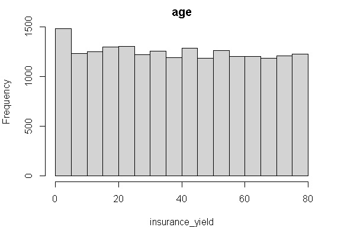
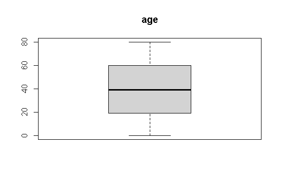
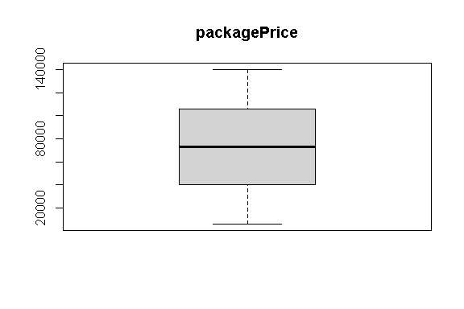
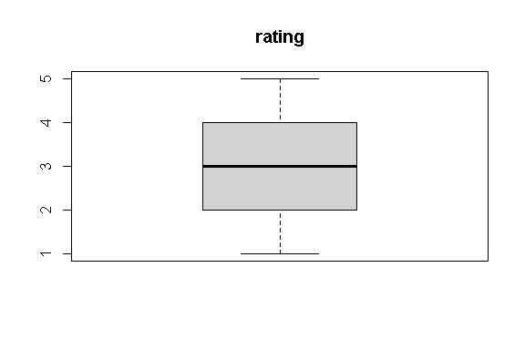
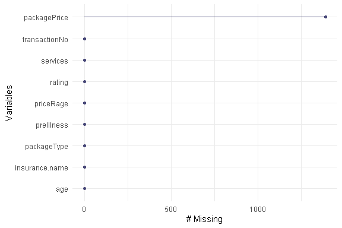

Business Intelligence Project
================

- [Student Details](#student-details)
- [Setup Chunk](#setup-chunk)
- [Load dataset](#load-dataset)
- [Exploratory Data Analysis](#exploratory-data-analysis)
  - [Dimensions](#dimensions)
  - [Descriptive Statistics](#descriptive-statistics)
    - [Measures of frequency](#measures-of-frequency)
    - [Measures of central tendency](#measures-of-central-tendency)
    - [Measures of distribution](#measures-of-distribution)
      - [Measure the variance of the age
        variable](#measure-the-variance-of-the-age-variable)
      - [Measure the standard deviation of age
        variable](#measure-the-standard-deviation-of-age-variable)
      - [Measure the kurtosis of each age
        variable](#measure-the-kurtosis-of-each-age-variable)
      - [Measure the skewness of each
        variable](#measure-the-skewness-of-each-variable)
    - [Measures of relationship](#measures-of-relationship)
      - [Measure the covariance between
        variables](#measure-the-covariance-between-variables)
      - [Measure the correlation between
        variables](#measure-the-correlation-between-variables)
  - [Inferential statistics](#inferential-statistics)
    - [Perform ANOVA](#perform-anova)
      - [One-Way ANOVA](#one-way-anova)
      - [Two-Way ANOVA](#two-way-anova)
  - [Basic Visualization](#basic-visualization)
    - [Univariate plots](#univariate-plots)
      - [create histograms](#create-histograms)
      - [Create Box and Whisker Plots for Each Numeric
        Attribute](#create-box-and-whisker-plots-for-each-numeric-attribute)
      - [Create Bar Plots for Each Categorical
        Attribute](#create-bar-plots-for-each-categorical-attribute)
    - [Multivariate Plots](#multivariate-plots)
      - [Create a Correlation Plot](#create-a-correlation-plot)
  - [Qualitative Data Analysis](#qualitative-data-analysis)
  - [Contractions](#contractions)
    - [removal of special characters and conversion of
      lowercase](#removal-of-special-characters-and-conversion-of-lowercase)
- [Pre-prosessing and Data
  Transformation](#pre-prosessing-and-data-transformation)
  - [Handle missing values —-](#handle-missing-values--)
    - [Are there missing values in the
      dataset?](#are-there-missing-values-in-the-dataset)
    - [How many?](#how-many)
    - [What is the proportion of missing data in the entire
      dataset?](#what-is-the-proportion-of-missing-data-in-the-entire-dataset)
    - [How many missing values does each variable
      have?](#how-many-missing-values-does-each-variable-have)
    - [What is the number and percentage of missing values grouped by
      each
      variable?](#what-is-the-number-and-percentage-of-missing-values-grouped-by-each-variable)
    - [What is the number and percentage of missing values grouped by
      each
      observation?](#what-is-the-number-and-percentage-of-missing-values-grouped-by-each-observation)
    - [Which variables contain the most missing
      values?](#which-variables-contain-the-most-missing-values)
    - [Where are missing values located (the shaded regions in the
      plot)?](#where-are-missing-values-located-the-shaded-regions-in-the-plot)
  - [Remove the observations with missing
    values](#remove-the-observations-with-missing-values)
    - [Are there missing values in the
      dataset?](#are-there-missing-values-in-the-dataset-1)
- [Training the Model](#training-the-model)
- [Hyper-parameter Tuning and
  Ensembles](#hyper-parameter-tuning-and-ensembles)
- [Consolidation](#consolidation)

# Student Details

|                                              |                             |
|----------------------------------------------|-----------------------------|
| **Student ID Number**                        | 119630,135844,131038,104135 |
| **Student Name**                             | beasts                      |
| **BBIT 4.2 Group**                           | A&B&C                       |
| **BI Project Group Name/ID (if applicable)** | beasts                      |

# Setup Chunk

**Note:** the following KnitR options have been set as the global
defaults: <BR>
`knitr::opts_chunk$set(echo = TRUE, warning = FALSE, eval = TRUE, collapse = FALSE, tidy = TRUE)`.

More KnitR options are documented here
<https://bookdown.org/yihui/rmarkdown-cookbook/chunk-options.html> and
here <https://yihui.org/knitr/options/>.

# Load dataset

``` r
insurance <- read.csv("data/insurance_info.csv")
```

# Exploratory Data Analysis

### Dimensions

``` r
# display the dimensions of your datasets
dim(insurance)
```

    ## [1] 19999     9

``` r
#Identify the Data Types
sapply(insurance, class)
```

    ## insurance.name   packagePrice       services      priceRage    packageType 
    ##    "character"      "integer"    "character"    "character"    "character" 
    ##            age     preIllness         rating  transactionNo 
    ##      "integer"    "character"      "numeric"    "character"

## Descriptive Statistics

### Measures of frequency

``` r
insurance_freq <- insurance$age
cbind(frequency = table(insurance_freq),
      percentage = prop.table(table(insurance_freq)) * 100)
```

    ##    frequency percentage
    ## 0        235   1.175059
    ## 1        252   1.260063
    ## 2        246   1.230062
    ## 3        244   1.220061
    ## 4        240   1.200060
    ## 5        266   1.330067
    ## 6        243   1.215061
    ## 7        231   1.155058
    ## 8        232   1.160058
    ## 9        234   1.170059
    ## 10       294   1.470074
    ## 11       242   1.210061
    ## 12       251   1.255063
    ## 13       254   1.270064
    ## 14       250   1.250063
    ## 15       254   1.270064
    ## 16       254   1.270064
    ## 17       260   1.300065
    ## 18       254   1.270064
    ## 19       269   1.345067
    ## 20       259   1.295065
    ## 21       256   1.280064
    ## 22       274   1.370069
    ## 23       232   1.160058
    ## 24       271   1.355068
    ## 25       270   1.350068
    ## 26       260   1.300065
    ## 27       219   1.095055
    ## 28       237   1.185059
    ## 29       266   1.330067
    ## 30       235   1.175059
    ## 31       244   1.220061
    ## 32       245   1.225061
    ## 33       240   1.200060
    ## 34       253   1.265063
    ## 35       273   1.365068
    ## 36       238   1.190060
    ## 37       233   1.165058
    ## 38       230   1.150058
    ## 39       260   1.300065
    ## 40       230   1.150058
    ## 41       223   1.115056
    ## 42       271   1.355068
    ## 43       280   1.400070
    ## 44       258   1.290065
    ## 45       253   1.265063
    ## 46       251   1.255063
    ## 47       220   1.100055
    ## 48       236   1.180059
    ## 49       257   1.285064
    ## 50       222   1.110056
    ## 51       240   1.200060
    ## 52       273   1.365068
    ## 53       258   1.290065
    ## 54       251   1.255063
    ## 55       241   1.205060
    ## 56       255   1.275064
    ## 57       238   1.190060
    ## 58       248   1.240062
    ## 59       217   1.085054
    ## 60       247   1.235062
    ## 61       238   1.190060
    ## 62       245   1.225061
    ## 63       212   1.060053
    ## 64       251   1.255063
    ## 65       259   1.295065
    ## 66       240   1.200060
    ## 67       253   1.265063
    ## 68       239   1.195060
    ## 69       230   1.150058
    ## 70       225   1.125056
    ## 71       229   1.145057
    ## 72       235   1.175059
    ## 73       266   1.330067
    ## 74       247   1.235062
    ## 75       234   1.170059
    ## 76       249   1.245062
    ## 77       235   1.175059
    ## 78       275   1.375069
    ## 79       234   1.170059
    ## 80       234   1.170059

### Measures of central tendency

``` r
insurance_mode <- names(table(insurance$age))[
  which(table(insurance$age) == max(table(insurance$age)))
]
print(insurance_mode)
```

    ## [1] "10"

### Measures of distribution

#### Measure the variance of the age variable

``` r
var(insurance[, 6])
```

    ## [1] 543.9234

#### Measure the standard deviation of age variable

``` r
sd(insurance[, 6] )
```

    ## [1] 23.32216

#### Measure the kurtosis of each age variable

``` r
library(moments)

kurtosis(insurance[, 6], na.rm = TRUE)
```

    ## [1] 1.803244

#### Measure the skewness of each variable

``` r
skewness(insurance[, 6])
```

    ## [1] 0.02437794

### Measures of relationship

#### Measure the covariance between variables

``` r
insurance_cov <- cov(insurance[,c(8, 6)])
View(insurance_cov)
```

#### Measure the correlation between variables

``` r
insurance_cor <- cor(insurance[, c(8, 6)])
View(insurance_cor)
```

## Inferential statistics

### Perform ANOVA

#### One-Way ANOVA

``` r
insurance_one_way_anova <- aov(age ~ rating, data = insurance)
summary(insurance_one_way_anova)
```

    ##                Df   Sum Sq Mean Sq F value Pr(>F)  
    ## rating          1     1524  1523.6   2.801 0.0942 .
    ## Residuals   19997 10875856   543.9                 
    ## ---
    ## Signif. codes:  0 '***' 0.001 '**' 0.01 '*' 0.05 '.' 0.1 ' ' 1

#### Two-Way ANOVA

``` r
insurance_additive_two_way_anova <- aov(age ~ rating + packagePrice, # nolint
                                           data = insurance)
summary(insurance_additive_two_way_anova)
```

    ##                 Df   Sum Sq Mean Sq F value Pr(>F)  
    ## rating           1     1729  1728.9   3.185 0.0743 .
    ## packagePrice     1     1062  1061.7   1.956 0.1620  
    ## Residuals    18606 10099494   542.8                 
    ## ---
    ## Signif. codes:  0 '***' 0.001 '**' 0.01 '*' 0.05 '.' 0.1 ' ' 1
    ## 1390 observations deleted due to missingness

## Basic Visualization

### Univariate plots

#### create histograms

``` r
par(mar = c(4, 4, 2, 2)) 

insurance_yield <- as.numeric(unlist(insurance[, 6]))
hist(insurance_yield, main = names(insurance)[6])
```

<!-- -->

#### Create Box and Whisker Plots for Each Numeric Attribute

``` r
boxplot(insurance[, 6], main = names(insurance)[6])
```

<!-- -->

``` r
boxplot(insurance[, 2], main = names(insurance)[2])
```

<!-- -->

``` r
boxplot(insurance[, 8], main = names(insurance)[8])
```

<!-- -->

#### Create Bar Plots for Each Categorical Attribute

``` r
barplot(table(insurance[, 3]), main = names(insurance)[3])
```

<!-- -->

### Multivariate Plots

#### Create a Correlation Plot

``` r
library(corrplot)
```

    ## corrplot 0.92 loaded

``` r
corrplot(cor(insurance[, c(2, 6)]), method = "circle")
```

<!-- -->

## Qualitative Data Analysis

## Contractions

### removal of special characters and conversion of lowercase

``` r
remove_special_characters <- function(doc) {
  gsub("[^a-zA-Z0-9 ]", "", doc, ignore.case = TRUE)
}


insurance$preIllness <- sapply(insurance$preIllness, tolower) # nolint
insurance$services <- sapply(insurance$services, tolower) # nolint
insurance$packageType <- sapply(insurance$packageType, tolower) # nolint
insurance$priceRage <- sapply(insurance$priceRage, tolower) # nolint
View(insurance)
```

# Pre-prosessing and Data Transformation

## Handle missing values —-

### Are there missing values in the dataset?

``` r
library(tidyverse)
```

    ## ── Attaching core tidyverse packages ──────────────────────── tidyverse 2.0.0 ──
    ## ✔ dplyr     1.1.3     ✔ readr     2.1.4
    ## ✔ forcats   1.0.0     ✔ stringr   1.5.1
    ## ✔ ggplot2   3.4.4     ✔ tibble    3.2.1
    ## ✔ lubridate 1.9.3     ✔ tidyr     1.3.0
    ## ✔ purrr     1.0.2     
    ## ── Conflicts ────────────────────────────────────────── tidyverse_conflicts() ──
    ## ✖ dplyr::filter() masks stats::filter()
    ## ✖ dplyr::lag()    masks stats::lag()
    ## ℹ Use the conflicted package (<http://conflicted.r-lib.org/>) to force all conflicts to become errors

``` r
anyNA(insurance)
```

    ## [1] TRUE

### How many?

``` r
library(naniar)

n_miss(insurance)
```

    ## [1] 1390

### What is the proportion of missing data in the entire dataset?

``` r
prop_miss(insurance)
```

    ## [1] 0.007722608

### How many missing values does each variable have?

``` r
insurance %>% is.na() %>% colSums()
```

    ## insurance.name   packagePrice       services      priceRage    packageType 
    ##              0           1390              0              0              0 
    ##            age     preIllness         rating  transactionNo 
    ##              0              0              0              0

### What is the number and percentage of missing values grouped by each variable?

``` r
miss_var_summary(insurance)
```

    ## # A tibble: 9 × 3
    ##   variable       n_miss pct_miss
    ##   <chr>           <int>    <dbl>
    ## 1 packagePrice     1390     6.95
    ## 2 insurance.name      0     0   
    ## 3 services            0     0   
    ## 4 priceRage           0     0   
    ## 5 packageType         0     0   
    ## 6 age                 0     0   
    ## 7 preIllness          0     0   
    ## 8 rating              0     0   
    ## 9 transactionNo       0     0

### What is the number and percentage of missing values grouped by each observation?

``` r
miss_case_summary(insurance)
```

    ## # A tibble: 19,999 × 3
    ##     case n_miss pct_miss
    ##    <int>  <int>    <dbl>
    ##  1   217      1     11.1
    ##  2   302      1     11.1
    ##  3   304      1     11.1
    ##  4   381      1     11.1
    ##  5   418      1     11.1
    ##  6   424      1     11.1
    ##  7   642      1     11.1
    ##  8   982      1     11.1
    ##  9  1045      1     11.1
    ## 10  1159      1     11.1
    ## # ℹ 19,989 more rows

### Which variables contain the most missing values?

``` r
gg_miss_var(insurance)
```

<!-- -->

### Where are missing values located (the shaded regions in the plot)?

``` r
library(naniar)
library(ggplot2)

vis_miss(insurance) + theme(axis.text.x = element_text(angle = 80))
```

<!-- -->

## Remove the observations with missing values

``` r
insurance_obs <- insurance %>% filter(complete.cases(.))
dim(insurance_obs)
```

    ## [1] 18609     9

#### Are there missing values in the dataset?

``` r
any_na(insurance_obs)
```

    ## [1] FALSE

# Training the Model

# Hyper-parameter Tuning and Ensembles

# Consolidation
