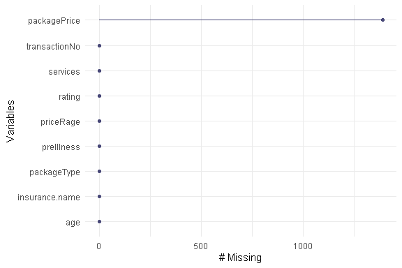
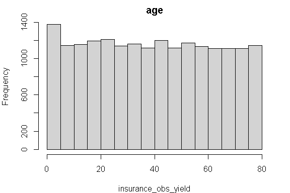
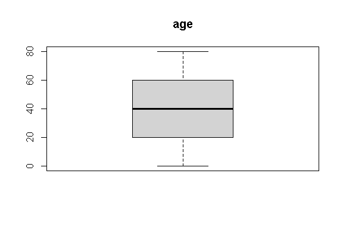
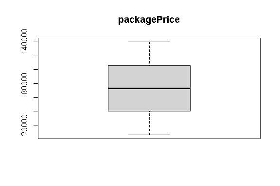
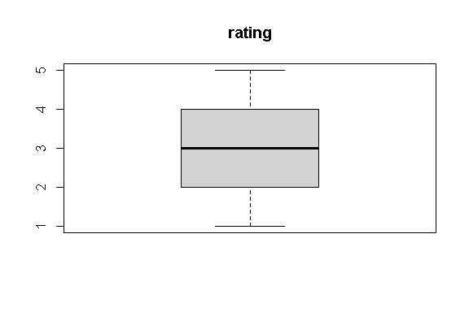
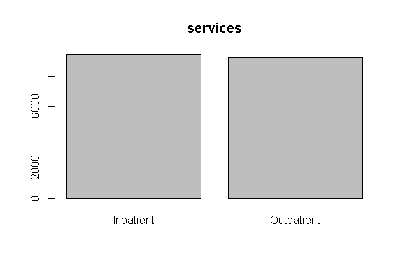
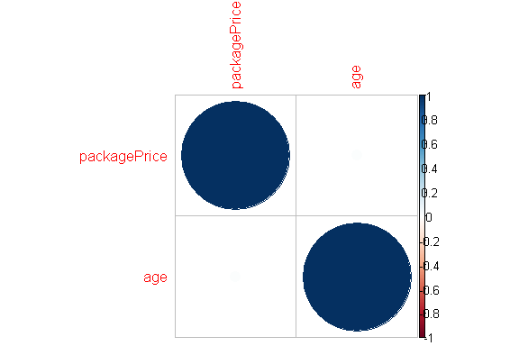

Business Intelligence Project
================

- [Student Details](#student-details)
- [Setup Chunk](#setup-chunk)
  - [Load dataset](#load-dataset)
- [Handle missing values —-](#handle-missing-values--)
  - [Are there missing values in the
    dataset?](#are-there-missing-values-in-the-dataset)
  - [How many?](#how-many)
  - [What is the proportion of missing data in the entire
    dataset?](#what-is-the-proportion-of-missing-data-in-the-entire-dataset)
  - [What is the number and percentage of missing values grouped by each
    variable?](#what-is-the-number-and-percentage-of-missing-values-grouped-by-each-variable)
  - [Which variables contain the most missing
    values?](#which-variables-contain-the-most-missing-values)
  - [Remove the observations with missing values
    —-](#remove-the-observations-with-missing-values--)
    - [Are there missing values in the
      dataset?](#are-there-missing-values-in-the-dataset-1)
- [Exploratory Data Analysis](#exploratory-data-analysis)
  - [Dimensions](#dimensions)
  - [Descriptive Statistics](#descriptive-statistics)
    - [Measures of frequency](#measures-of-frequency)
    - [Measures of central tendency](#measures-of-central-tendency)
    - [Measures of distribution](#measures-of-distribution)
      - [Measure the variance of the age
        variable](#measure-the-variance-of-the-age-variable)
      - [Measure the standard deviation of age
        variable](#measure-the-standard-deviation-of-age-variable)
      - [Measure the kurtosis of each age
        variable](#measure-the-kurtosis-of-each-age-variable)
      - [Measure the skewness of each
        variable](#measure-the-skewness-of-each-variable)
    - [Measures of relationship](#measures-of-relationship)
      - [Measure the covariance between
        variables](#measure-the-covariance-between-variables)
      - [Measure the correlation between
        variables](#measure-the-correlation-between-variables)
  - [Inferential statistics](#inferential-statistics)
    - [Perform ANOVA](#perform-anova)
      - [One-Way ANOVA](#one-way-anova)
      - [Two-Way ANOVA](#two-way-anova)
  - [Basic Visualization](#basic-visualization)
    - [Univariate plots](#univariate-plots)
      - [create histograms](#create-histograms)
      - [Create Box and Whisker Plots for Each Numeric
        Attribute](#create-box-and-whisker-plots-for-each-numeric-attribute)
      - [Create Bar Plots for Each Categorical
        Attribute](#create-bar-plots-for-each-categorical-attribute)
    - [Multivariate Plots](#multivariate-plots)
      - [Create a Correlation Plot](#create-a-correlation-plot)
  - [Qualitative Data Analysis](#qualitative-data-analysis)
    - [Customize the Visualizations, Tables, and Colour
      Scheme](#customize-the-visualizations-tables-and-colour-scheme)
      - [blue-grey colour scheme for the
        visualizations](#blue-grey-colour-scheme-for-the-visualizations)
      - [Custom theme for
        visualizations](#custom-theme-for-visualizations)
      - [Customize the text tables for consistency using HTML
        formatting](#customize-the-text-tables-for-consistency-using-html-formatting)
    - [Contractions](#contractions)
      - [removal of special characters and conversion of
        lowercase](#removal-of-special-characters-and-conversion-of-lowercase)
- [Pre-prosessing and Data
  Transformation](#pre-prosessing-and-data-transformation)
- [Training the Model](#training-the-model)
- [Hyper-parameter Tuning and
  Ensembles](#hyper-parameter-tuning-and-ensembles)
- [Consolidation](#consolidation)

# Student Details

|                                              |                             |
|----------------------------------------------|-----------------------------|
| **Student ID Number**                        | 119630,135844,131038,104135 |
| **Student Name**                             | beasts                      |
| **BBIT 4.2 Group**                           | A&B&C                       |
| **BI Project Group Name/ID (if applicable)** | beasts                      |

# Setup Chunk

**Note:** the following KnitR options have been set as the global
defaults: <BR>
`knitr::opts_chunk$set(echo = TRUE, warning = FALSE, eval = TRUE, collapse = FALSE, tidy = TRUE)`.

More KnitR options are documented here
<https://bookdown.org/yihui/rmarkdown-cookbook/chunk-options.html> and
here <https://yihui.org/knitr/options/>.

## Load dataset

``` r
insurance <- read.csv("data/insurance_info.csv")
```

# Handle missing values —-

### Are there missing values in the dataset?

``` r
library(tidyverse)
```

    ## ── Attaching core tidyverse packages ──────────────────────── tidyverse 2.0.0 ──
    ## ✔ dplyr     1.1.3     ✔ readr     2.1.4
    ## ✔ forcats   1.0.0     ✔ stringr   1.5.1
    ## ✔ ggplot2   3.4.4     ✔ tibble    3.2.1
    ## ✔ lubridate 1.9.3     ✔ tidyr     1.3.0
    ## ✔ purrr     1.0.2     
    ## ── Conflicts ────────────────────────────────────────── tidyverse_conflicts() ──
    ## ✖ dplyr::filter() masks stats::filter()
    ## ✖ dplyr::lag()    masks stats::lag()
    ## ℹ Use the conflicted package (<http://conflicted.r-lib.org/>) to force all conflicts to become errors

``` r
anyNA(insurance)
```

    ## [1] TRUE

### How many?

``` r
library(naniar)

n_miss(insurance)
```

    ## [1] 1390

### What is the proportion of missing data in the entire dataset?

``` r
prop_miss(insurance)
```

    ## [1] 0.007722608

### What is the number and percentage of missing values grouped by each variable?

``` r
miss_var_summary(insurance)
```

    ## # A tibble: 9 × 3
    ##   variable       n_miss pct_miss
    ##   <chr>           <int>    <dbl>
    ## 1 packagePrice     1390     6.95
    ## 2 insurance.name      0     0   
    ## 3 services            0     0   
    ## 4 priceRage           0     0   
    ## 5 packageType         0     0   
    ## 6 age                 0     0   
    ## 7 preIllness          0     0   
    ## 8 rating              0     0   
    ## 9 transactionNo       0     0

### Which variables contain the most missing values?

``` r
gg_miss_var(insurance)
```

<!-- -->

## Remove the observations with missing values —-

``` r
insurance_obs <- insurance %>% filter(complete.cases(.))
dim(insurance_obs)
```

    ## [1] 18609     9

#### Are there missing values in the dataset?

``` r
any_na(insurance_obs)
```

    ## [1] FALSE

# Exploratory Data Analysis

### Dimensions

``` r
# display the dimensions of your datasets
dim(insurance_obs)
```

    ## [1] 18609     9

``` r
#Identify the Data Types
sapply(insurance_obs, class)
```

    ## insurance.name   packagePrice       services      priceRage    packageType 
    ##    "character"      "integer"    "character"    "character"    "character" 
    ##            age     preIllness         rating  transactionNo 
    ##      "integer"    "character"      "numeric"    "character"

## Descriptive Statistics

### Measures of frequency

``` r
insurance_obs_freq <- insurance_obs$age
cbind(frequency = table(insurance_obs_freq),
      percentage = prop.table(table(insurance_obs_freq)) * 100)
```

    ##    frequency percentage
    ## 0        217   1.166102
    ## 1        230   1.235961
    ## 2        231   1.241335
    ## 3        229   1.230587
    ## 4        219   1.176850
    ## 5        252   1.354183
    ## 6        226   1.214466
    ## 7        216   1.160729
    ## 8        212   1.139234
    ## 9        220   1.182224
    ## 10       272   1.461658
    ## 11       225   1.209092
    ## 12       233   1.252082
    ## 13       240   1.289699
    ## 14       227   1.219840
    ## 15       233   1.252082
    ## 16       234   1.257456
    ## 17       240   1.289699
    ## 18       231   1.241335
    ## 19       246   1.321941
    ## 20       241   1.295072
    ## 21       240   1.289699
    ## 22       255   1.370305
    ## 23       213   1.144607
    ## 24       260   1.397173
    ## 25       245   1.316567
    ## 26       242   1.300446
    ## 27       206   1.106991
    ## 28       221   1.187597
    ## 29       253   1.359557
    ## 30       215   1.155355
    ## 31       224   1.203719
    ## 32       226   1.214466
    ## 33       220   1.182224
    ## 34       239   1.284325
    ## 35       254   1.364931
    ## 36       222   1.192971
    ## 37       221   1.187597
    ## 38       213   1.144607
    ## 39       243   1.305820
    ## 40       219   1.176850
    ## 41       209   1.123112
    ## 42       251   1.348810
    ## 43       264   1.418668
    ## 44       241   1.295072
    ## 45       236   1.268204
    ## 46       229   1.230587
    ## 47       211   1.133860
    ## 48       226   1.214466
    ## 49       244   1.311194
    ## 50       209   1.123112
    ## 51       222   1.192971
    ## 52       256   1.375678
    ## 53       239   1.284325
    ## 54       231   1.241335
    ## 55       224   1.203719
    ## 56       235   1.262830
    ## 57       226   1.214466
    ## 58       232   1.246709
    ## 59       203   1.090870
    ## 60       235   1.262830
    ## 61       218   1.171476
    ## 62       218   1.171476
    ## 63       200   1.074749
    ## 64       236   1.268204
    ## 65       240   1.289699
    ## 66       224   1.203719
    ## 67       234   1.257456
    ## 68       221   1.187597
    ## 69       218   1.171476
    ## 70       216   1.160729
    ## 71       205   1.101617
    ## 72       219   1.176850
    ## 73       242   1.300446
    ## 74       230   1.235961
    ## 75       216   1.160729
    ## 76       227   1.219840
    ## 77       220   1.182224
    ## 78       259   1.391800
    ## 79       220   1.182224
    ## 80       218   1.171476

### Measures of central tendency

``` r
insurance_obs_mode <- names(table(insurance_obs$age))[
  which(table(insurance_obs$age) == max(table(insurance_obs$age)))
]
print(insurance_obs_mode)
```

    ## [1] "10"

### Measures of distribution

#### Measure the variance of the age variable

``` r
var(insurance_obs[, 6])
```

    ## [1] 542.9001

#### Measure the standard deviation of age variable

``` r
sd(insurance_obs[, 6] )
```

    ## [1] 23.30022

#### Measure the kurtosis of each age variable

``` r
library(moments)

kurtosis(insurance_obs[, 6], na.rm = TRUE)
```

    ## [1] 1.806842

#### Measure the skewness of each variable

``` r
skewness(insurance_obs[, 6])
```

    ## [1] 0.02210227

### Measures of relationship

#### Measure the covariance between variables

``` r
insurance_obs_cov <- cov(insurance_obs[,c(2, 6)])
View(insurance_obs_cov)
```

#### Measure the correlation between variables

``` r
insurance_obs_cor <- cor(insurance_obs[, c(2, 6)])
View(insurance_obs_cor)
```

## Inferential statistics

### Perform ANOVA

#### One-Way ANOVA

``` r
insurance_obs_one_way_anova <- aov(age ~ rating, data = insurance_obs)
summary(insurance_obs_one_way_anova)
```

    ##                Df   Sum Sq Mean Sq F value Pr(>F)  
    ## rating          1     1729  1728.9   3.185 0.0743 .
    ## Residuals   18607 10100555   542.8                 
    ## ---
    ## Signif. codes:  0 '***' 0.001 '**' 0.01 '*' 0.05 '.' 0.1 ' ' 1

#### Two-Way ANOVA

``` r
insurance_obs_additive_two_way_anova <- aov(age ~ rating + packagePrice, # nolint
                                           data = insurance_obs)
summary(insurance_obs_additive_two_way_anova)
```

    ##                 Df   Sum Sq Mean Sq F value Pr(>F)  
    ## rating           1     1729  1728.9   3.185 0.0743 .
    ## packagePrice     1     1062  1061.7   1.956 0.1620  
    ## Residuals    18606 10099494   542.8                 
    ## ---
    ## Signif. codes:  0 '***' 0.001 '**' 0.01 '*' 0.05 '.' 0.1 ' ' 1

## Basic Visualization

### Univariate plots

#### create histograms

``` r
par(mar = c(4, 4, 2, 2)) 

insurance_obs_yield <- as.numeric(unlist(insurance_obs[, 6]))
hist(insurance_obs_yield, main = names(insurance_obs)[6])
```

<!-- -->

#### Create Box and Whisker Plots for Each Numeric Attribute

``` r
boxplot(insurance_obs[, 6], main = names(insurance_obs)[6])
```

<!-- -->

``` r
boxplot(insurance_obs[, 2], main = names(insurance_obs)[2])
```

<!-- -->

``` r
boxplot(insurance_obs[, 8], main = names(insurance_obs)[8])
```

<!-- -->

#### Create Bar Plots for Each Categorical Attribute

``` r
barplot(table(insurance_obs[, 3]), main = names(insurance_obs)[3])
```

<!-- -->

### Multivariate Plots

#### Create a Correlation Plot

``` r
library(corrplot)
```

    ## corrplot 0.92 loaded

``` r
corrplot(cor(insurance_obs[, c(2, 6)]), method = "circle")
```

<!-- -->

## Qualitative Data Analysis

### Customize the Visualizations, Tables, and Colour Scheme

#### blue-grey colour scheme for the visualizations

``` r
blue_grey_colours_11 <- c("#27408E", "#304FAF", "#536CB5", "#6981c7", "#8da0db", "#dde5ec", "#c8c9ca", "#B9BCC2", "#A7AAAF", "#888A8E", "#636569")

blue_grey_colours_6 <- c("#27408E", "#304FAF", "#536CB5", "#B9BCC2", "#A7AAAF", "#888A8E")

blue_grey_colours_4 <- c("#27408E", "#536CB5", "#B9BCC2", "#888A8E")

blue_grey_colours_2 <- c("#27408E", "#888A8E")

blue_grey_colours_1 <- c("#6981c7")
```

#### Custom theme for visualizations

``` r
blue_grey_theme <- function() {
  theme(
    axis.ticks = element_line(
                              linewidth = 1, linetype = "dashed",
                              lineend = NULL, color = "#dfdede",
                              arrow = NULL, inherit.blank = FALSE),
    axis.text = element_text(
                             face = "bold", color = "#3f3f41",
                             size = 12, hjust = 0.5),
    axis.title = element_text(face = "bold", color = "#3f3f41",
                              size = 14, hjust = 0.5),
    plot.title = element_text(face = "bold", color = "#3f3f41",
                              size = 16, hjust = 0.5),
    panel.grid = element_line(
                              linewidth = 0.1, linetype = "dashed",
                              lineend = NULL, color = "#dfdede",
                              arrow = NULL, inherit.blank = FALSE),
    panel.background = element_rect(fill = "#f3eeee"),
    legend.title = element_text(face = "plain", color = "#3f3f41",
                                size = 12, hjust = 0),
    legend.position = "right"
  )
}
```

#### Customize the text tables for consistency using HTML formatting

``` r
kable_theme <- function(dat, caption) {
  kable(dat, "html", escape = FALSE, caption = caption) %>%
    kable_styling(bootstrap_options = c("striped", "condensed", "bordered"),
                  full_width = FALSE)
}
```

### Contractions

#### removal of special characters and conversion of lowercase

``` r
remove_special_characters <- function(doc) {
  gsub("[^a-zA-Z0-9 ]", "", doc, ignore.case = TRUE)
}


insurance_obs$preIllness <- sapply(insurance_obs$preIllness, tolower) # nolint
insurance_obs$services <- sapply(insurance_obs$services, tolower) # nolint
insurance_obs$packageType <- sapply(insurance_obs$packageType, tolower) # nolint
insurance_obs$priceRage <- sapply(insurance_obs$priceRage, tolower) # nolint
View(insurance_obs)
```

# Pre-prosessing and Data Transformation

# Training the Model

# Hyper-parameter Tuning and Ensembles

# Consolidation
