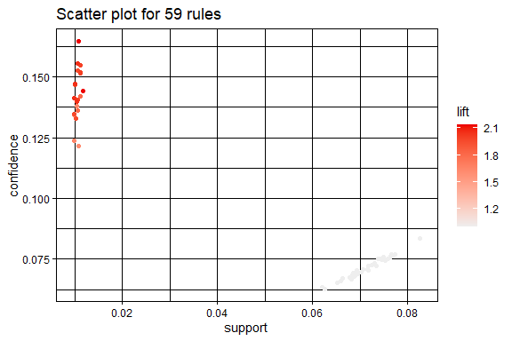
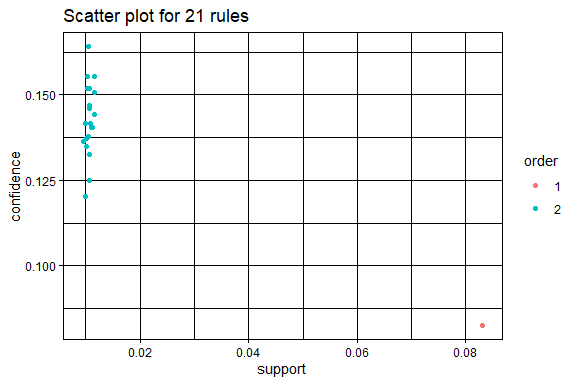

Business Intelligence Project
================

- [Student Details](#student-details)
- [Setup Chunk](#setup-chunk)
- [Load dataset](#load-dataset)
- [Exploratory Data Analysis](#exploratory-data-analysis)
  - [Dimensions](#dimensions)
  - [Data Types](#data-types)
  - [Descriptive Statistics](#descriptive-statistics)
    - [Measures of Frequency](#measures-of-frequency)
    - [Measures of Central Tendency](#measures-of-central-tendency)
  - [Measures of
    Distribution/Dispersion/Spread/Scatter/Variability](#measures-of-distributiondispersionspreadscattervariability)
    - [Measure the distribution of the data for each
      variable](#measure-the-distribution-of-the-data-for-each-variable)
    - [Measure the standard deviation of each
      variable](#measure-the-standard-deviation-of-each-variable)
    - [Measure the variance of each
      variable](#measure-the-variance-of-each-variable)
    - [Measure the kurtosis of each
      variable](#measure-the-kurtosis-of-each-variable)
    - [Measure the skewness of each
      variable](#measure-the-skewness-of-each-variable)
  - [Measures of Relationship](#measures-of-relationship)
    - [Measure the covariance between
      variables](#measure-the-covariance-between-variables)
    - [Measure the correlation between
      variables](#measure-the-correlation-between-variables)
  - [Inferential Statistics](#inferential-statistics)
    - [Perform ANOVA](#perform-anova)
      - [One-Way ANOVA](#one-way-anova)
      - [Two-Way ANOVA](#two-way-anova)
  - [Qualitative Data Analysis](#qualitative-data-analysis)
    - [Univariate plots](#univariate-plots)
      - [Create histograms](#create-histograms)
      - [Create Box and Whisker Plots for Each Numeric
        Attribute](#create-box-and-whisker-plots-for-each-numeric-attribute)
      - [Create a Missingness Map to Identify Missing
        Data](#create-a-missingness-map-to-identify-missing-data)
    - [Multivariate Plots](#multivariate-plots)
      - [Create a Correlation Plot](#create-a-correlation-plot)
- [Data Imputation](#data-imputation)
  - [Handle missing values](#handle-missing-values)
    - [Are there missing values in the
      dataset?](#are-there-missing-values-in-the-dataset)
    - [How many?](#how-many)
    - [What is the proportion of missing data in the entire
      dataset?](#what-is-the-proportion-of-missing-data-in-the-entire-dataset)
    - [How many missing values does each variable
      have?](#how-many-missing-values-does-each-variable-have)
    - [What is the number and percentage of missing values grouped by
      each
      variable?](#what-is-the-number-and-percentage-of-missing-values-grouped-by-each-variable)
    - [What is the number and percentage of missing values grouped by
      each
      observation?](#what-is-the-number-and-percentage-of-missing-values-grouped-by-each-observation)
    - [Which variables contain the most missing
      values?](#which-variables-contain-the-most-missing-values)
  - [Remove the observations with missing
    values](#remove-the-observations-with-missing-values)
- [Data transformation](#data-transformation)
  - [The Scale Basic Transform](#the-scale-basic-transform)
    - [Before](#before)
    - [After](#after)
  - [Center Data Transform](#center-data-transform)
  - [Standardize Data Transform](#standardize-data-transform)
    - [Before](#before-1)
    - [After](#after-1)
  - [Normalize Data Transform](#normalize-data-transform)
  - [Box-Cox Power Transform](#box-cox-power-transform)
    - [Before](#before-2)
    - [After](#after-2)
  - [Yeo-Johnson Power Transform](#yeo-johnson-power-transform)
    - [Before](#before-3)
    - [After](#after-3)
  - [PCA for Dimensionality
    Reduction](#pca-for-dimensionality-reduction)
  - [ICA for Dimensionality Reduction on the Boston Housing
    Dataset](#ica-for-dimensionality-reduction-on-the-boston-housing-dataset)
- [Train Model](#train-model)
  - [Split the dataset](#split-the-dataset)
  - [Single Format](#single-format)
  - [Basket Format](#basket-format)
  - [Create a transaction data using the “basket
    format”](#create-a-transaction-data-using-the-basket-format)
    - [Record only the `items`
      variable](#record-only-the-items-variable)
  - [Save the transactions in CSV
    format](#save-the-transactions-in-csv-format)
  - [Read the transactions from the CSV
    file](#read-the-transactions-from-the-csv-file)
  - [Basic EDA](#basic-eda)
  - [Create the association rules](#create-the-association-rules)
  - [Find specific rules](#find-specific-rules)
  - [Visualize the rules](#visualize-the-rules)
    - [Filter rules with confidence greater than 0.85 or
      85%](#filter-rules-with-confidence-greater-than-085-or-85)
    - [Filter top 20 rules with highest
      lift](#filter-top-20-rules-with-highest-lift)

# Student Details

|                                              |                             |
|----------------------------------------------|-----------------------------|
| **Student ID Number**                        | 119630,135844,131038,104135 |
| **Student Name**                             | beasts                      |
| **BBIT 4.2 Group**                           | A&B&C                       |
| **BI Project Group Name/ID (if applicable)** | beasts                      |

# Setup Chunk

**Note:** the following KnitR options have been set as the global
defaults: <BR>
`knitr::opts_chunk$set(echo = TRUE, warning = FALSE, eval = TRUE, collapse = FALSE, tidy = TRUE)`.

More KnitR options are documented here
<https://bookdown.org/yihui/rmarkdown-cookbook/chunk-options.html> and
here <https://yihui.org/knitr/options/>.

# Load dataset

``` r
insurance <- read.csv("data/insurance_info.csv")
```

# Exploratory Data Analysis

## Dimensions

``` r
dim(insurance)
```

    ## [1] 19999     9

## Data Types

``` r
sapply(insurance, class)
```

    ## insurance.name   packagePrice       services      priceRage    packageType 
    ##    "character"      "integer"    "character"    "character"    "character" 
    ##            age     preIllness         rating  transactionNo 
    ##      "integer"    "character"      "numeric"    "character"

## Descriptive Statistics

### Measures of Frequency

``` r
insurance_rating_freq <- insurance$rating
cbind(frequency = table(insurance_rating_freq),
      percentage = prop.table(table(insurance_rating_freq)) * 100)
```

    ##     frequency percentage
    ## 1         263   1.315066
    ## 1.1       522   2.610131
    ## 1.2       519   2.595130
    ## 1.3       523   2.615131
    ## 1.4       505   2.525126
    ## 1.5       506   2.530127
    ## 1.6       502   2.510126
    ## 1.7       467   2.335117
    ## 1.8       493   2.465123
    ## 1.9       466   2.330117
    ## 2         505   2.525126
    ## 2.1       505   2.525126
    ## 2.2       492   2.460123
    ## 2.3       494   2.470124
    ## 2.4       510   2.550128
    ## 2.5       506   2.530127
    ## 2.6       494   2.470124
    ## 2.7       479   2.395120
    ## 2.8       498   2.490125
    ## 2.9       506   2.530127
    ## 3         525   2.625131
    ## 3.1       516   2.580129
    ## 3.2       486   2.430122
    ## 3.3       533   2.665133
    ## 3.4       479   2.395120
    ## 3.5       504   2.520126
    ## 3.6       481   2.405120
    ## 3.7       520   2.600130
    ## 3.8       503   2.515126
    ## 3.9       530   2.650133
    ## 4         484   2.420121
    ## 4.1       460   2.300115
    ## 4.2       471   2.355118
    ## 4.3       483   2.415121
    ## 4.4       505   2.525126
    ## 4.5       486   2.430122
    ## 4.6       520   2.600130
    ## 4.7       510   2.550128
    ## 4.8       518   2.590130
    ## 4.9       492   2.460123
    ## 5         238   1.190060

### Measures of Central Tendency

``` r
insurance_rating_mode <- names(table(insurance$rating))[
  which(table(insurance$rating) == max(table(insurance$rating)))
]
print(insurance_rating_mode)
```

    ## [1] "3.3"

## Measures of Distribution/Dispersion/Spread/Scatter/Variability

### Measure the distribution of the data for each variable

``` r
summary(insurance)
```

    ##  insurance.name      packagePrice      services          priceRage        
    ##  Length:19999       Min.   :  6001   Length:19999       Length:19999      
    ##  Class :character   1st Qu.: 40045   Class :character   Class :character  
    ##  Mode  :character   Median : 73103   Mode  :character   Mode  :character  
    ##                     Mean   : 72979                                        
    ##                     3rd Qu.:106008                                        
    ##                     Max.   :140000                                        
    ##                     NA's   :1390                                          
    ##  packageType             age        preIllness            rating     
    ##  Length:19999       Min.   : 0.0   Length:19999       Min.   :1.000  
    ##  Class :character   1st Qu.:19.0   Class :character   1st Qu.:2.000  
    ##  Mode  :character   Median :39.0   Mode  :character   Median :3.000  
    ##                     Mean   :39.7                      Mean   :2.994  
    ##                     3rd Qu.:60.0                      3rd Qu.:4.000  
    ##                     Max.   :80.0                      Max.   :5.000  
    ##                                                                      
    ##  transactionNo     
    ##  Length:19999      
    ##  Class :character  
    ##  Mode  :character  
    ##                    
    ##                    
    ##                    
    ## 

### Measure the standard deviation of each variable

``` r
library(e1071)

sapply(insurance[, c(6,8)], sd)
```

    ##       age    rating 
    ## 23.322165  1.158061

### Measure the variance of each variable

``` r
sapply(insurance[, c(6,8)], var)
```

    ##        age     rating 
    ## 543.923379   1.341106

### Measure the kurtosis of each variable

``` r
library(e1071)

sapply(insurance[, c(6, 8)], kurtosis, type = 2)
```

    ##       age    rating 
    ## -1.196755 -1.193846

### Measure the skewness of each variable

``` r
sapply(insurance[, c(6, 8)],  skewness, type = 2)
```

    ##          age       rating 
    ## 0.0243797733 0.0009158415

## Measures of Relationship

### Measure the covariance between variables

``` r
insurance_cov <- cov(insurance[, c(6, 8)])
View(insurance_cov)
```

### Measure the correlation between variables

``` r
insurance_cor <- cor(insurance[, c(6, 8)])
View(insurance_cor)
```

## Inferential Statistics

### Perform ANOVA

#### One-Way ANOVA

``` r
insurance_one_way_anova <- aov(age ~ rating, data = insurance)
summary(insurance_one_way_anova)
```

    ##                Df   Sum Sq Mean Sq F value Pr(>F)  
    ## rating          1     1524  1523.6   2.801 0.0942 .
    ## Residuals   19997 10875856   543.9                 
    ## ---
    ## Signif. codes:  0 '***' 0.001 '**' 0.01 '*' 0.05 '.' 0.1 ' ' 1

#### Two-Way ANOVA

``` r
insurance_two_way_anova <- aov(packagePrice ~ rating + age, # nolint
                                           data = insurance)
summary(insurance_two_way_anova)
```

    ##                Df    Sum Sq   Mean Sq F value Pr(>F)
    ## rating          1 1.738e+08 1.738e+08   0.117  0.732
    ## age             1 2.906e+09 2.906e+09   1.956  0.162
    ## Residuals   18606 2.764e+13 1.486e+09               
    ## 1390 observations deleted due to missingness

## Qualitative Data Analysis

### Univariate plots

#### Create histograms

``` r
insurance_age <- as.numeric(unlist(insurance[, 6]))
hist(insurance_age, main = names(insurance)[6])
```

<!-- -->

#### Create Box and Whisker Plots for Each Numeric Attribute

``` r
par(mar = c(1, 1, 1, 1))

boxplot(insurance[, 6], main = names(insurance)[6])
```

<!-- -->

``` r
boxplot(insurance[, 2], main = names(insurance)[2])
```

<!-- -->

``` r
boxplot(insurance[, 8], main = names(insurance)[8])
```

<!-- -->

#### Create a Missingness Map to Identify Missing Data

``` r
library(Amelia)
```

    ## Loading required package: Rcpp

    ## ## 
    ## ## Amelia II: Multiple Imputation
    ## ## (Version 1.8.1, built: 2022-11-18)
    ## ## Copyright (C) 2005-2023 James Honaker, Gary King and Matthew Blackwell
    ## ## Refer to http://gking.harvard.edu/amelia/ for more information
    ## ##

``` r
missmap(insurance, col = c("red", "grey"), legend = TRUE)
```

<!-- -->

### Multivariate Plots

#### Create a Correlation Plot

``` r
library(corrplot)
```

    ## corrplot 0.92 loaded

``` r
corrplot(cor(insurance[, c(6, 8)]), method = "circle")
```

<!-- -->

# Data Imputation

## Handle missing values

### Are there missing values in the dataset?

``` r
library(tidyverse)
```

    ## ── Attaching core tidyverse packages ──────────────────────── tidyverse 2.0.0 ──
    ## ✔ dplyr     1.1.4     ✔ readr     2.1.4
    ## ✔ forcats   1.0.0     ✔ stringr   1.5.1
    ## ✔ ggplot2   3.4.4     ✔ tibble    3.2.1
    ## ✔ lubridate 1.9.3     ✔ tidyr     1.3.0
    ## ✔ purrr     1.0.2     
    ## ── Conflicts ────────────────────────────────────────── tidyverse_conflicts() ──
    ## ✖ dplyr::filter() masks stats::filter()
    ## ✖ dplyr::lag()    masks stats::lag()
    ## ℹ Use the conflicted package (<http://conflicted.r-lib.org/>) to force all conflicts to become errors

``` r
anyNA(insurance)
```

    ## [1] TRUE

### How many?

``` r
library(naniar)

n_miss(insurance)
```

    ## [1] 1390

### What is the proportion of missing data in the entire dataset?

``` r
prop_miss(insurance)
```

    ## [1] 0.007722608

### How many missing values does each variable have?

``` r
insurance %>% is.na() %>% colSums()
```

    ## insurance.name   packagePrice       services      priceRage    packageType 
    ##              0           1390              0              0              0 
    ##            age     preIllness         rating  transactionNo 
    ##              0              0              0              0

### What is the number and percentage of missing values grouped by each variable?

``` r
miss_var_summary(insurance)
```

    ## # A tibble: 9 × 3
    ##   variable       n_miss pct_miss
    ##   <chr>           <int>    <dbl>
    ## 1 packagePrice     1390     6.95
    ## 2 insurance.name      0     0   
    ## 3 services            0     0   
    ## 4 priceRage           0     0   
    ## 5 packageType         0     0   
    ## 6 age                 0     0   
    ## 7 preIllness          0     0   
    ## 8 rating              0     0   
    ## 9 transactionNo       0     0

### What is the number and percentage of missing values grouped by each observation?

``` r
miss_case_summary(insurance)
```

    ## # A tibble: 19,999 × 3
    ##     case n_miss pct_miss
    ##    <int>  <int>    <dbl>
    ##  1   217      1     11.1
    ##  2   302      1     11.1
    ##  3   304      1     11.1
    ##  4   381      1     11.1
    ##  5   418      1     11.1
    ##  6   424      1     11.1
    ##  7   642      1     11.1
    ##  8   982      1     11.1
    ##  9  1045      1     11.1
    ## 10  1159      1     11.1
    ## # ℹ 19,989 more rows

### Which variables contain the most missing values?

``` r
gg_miss_var(insurance)
```

<!-- -->

## Remove the observations with missing values

``` r
insurance_obs <- insurance %>% filter(complete.cases(.))
dim(insurance_obs)
```

    ## [1] 18609     9

# Data transformation

## The Scale Basic Transform

### Before

``` r
library(caret)
```

    ## Loading required package: lattice

    ## 
    ## Attaching package: 'caret'

    ## The following object is masked from 'package:purrr':
    ## 
    ##     lift

``` r
summary(insurance_obs)
```

    ##  insurance.name      packagePrice      services          priceRage        
    ##  Length:18609       Min.   :  6001   Length:18609       Length:18609      
    ##  Class :character   1st Qu.: 40045   Class :character   Class :character  
    ##  Mode  :character   Median : 73103   Mode  :character   Mode  :character  
    ##                     Mean   : 72979                                        
    ##                     3rd Qu.:106008                                        
    ##                     Max.   :140000                                        
    ##  packageType             age         preIllness            rating 
    ##  Length:18609       Min.   : 0.00   Length:18609       Min.   :1  
    ##  Class :character   1st Qu.:20.00   Class :character   1st Qu.:2  
    ##  Mode  :character   Median :40.00   Mode  :character   Median :3  
    ##                     Mean   :39.73                      Mean   :3  
    ##                     3rd Qu.:60.00                      3rd Qu.:4  
    ##                     Max.   :80.00                      Max.   :5  
    ##  transactionNo     
    ##  Length:18609      
    ##  Class :character  
    ##  Mode  :character  
    ##                    
    ##                    
    ## 

``` r
insurance_obs_yield <- as.numeric(unlist(insurance_obs[, 8]))
hist(insurance_obs_yield, main = names(insurance_obs)[8])
```

<!-- -->

``` r
model_of_the_transform <- preProcess(insurance_obs, method = c("scale"))
print(model_of_the_transform)
```

    ## Created from 18609 samples and 9 variables
    ## 
    ## Pre-processing:
    ##   - ignored (6)
    ##   - scaled (3)

``` r
insurance_scale_transform <- predict(model_of_the_transform, insurance_obs)
```

### After

``` r
summary(insurance_scale_transform)
```

    ##  insurance.name      packagePrice      services          priceRage        
    ##  Length:18609       Min.   :0.1557   Length:18609       Length:18609      
    ##  Class :character   1st Qu.:1.0389   Class :character   Class :character  
    ##  Mode  :character   Median :1.8966   Mode  :character   Mode  :character  
    ##                     Mean   :1.8934                                        
    ##                     3rd Qu.:2.7502                                        
    ##                     Max.   :3.6321                                        
    ##  packageType             age          preIllness            rating      
    ##  Length:18609       Min.   :0.0000   Length:18609       Min.   :0.8631  
    ##  Class :character   1st Qu.:0.8584   Class :character   1st Qu.:1.7261  
    ##  Mode  :character   Median :1.7167   Mode  :character   Median :2.5892  
    ##                     Mean   :1.7050                      Mean   :2.5893  
    ##                     3rd Qu.:2.5751                      3rd Qu.:3.4523  
    ##                     Max.   :3.4334                      Max.   :4.3154  
    ##  transactionNo     
    ##  Length:18609      
    ##  Class :character  
    ##  Mode  :character  
    ##                    
    ##                    
    ## 

``` r
insurance_obs_yield <- as.numeric(unlist(insurance_scale_transform[, 8]))
hist(insurance_obs_yield, main = names(insurance_scale_transform)[8])
```

<!-- -->

## Center Data Transform

``` r
summary(insurance_obs)
```

    ##  insurance.name      packagePrice      services          priceRage        
    ##  Length:18609       Min.   :  6001   Length:18609       Length:18609      
    ##  Class :character   1st Qu.: 40045   Class :character   Class :character  
    ##  Mode  :character   Median : 73103   Mode  :character   Mode  :character  
    ##                     Mean   : 72979                                        
    ##                     3rd Qu.:106008                                        
    ##                     Max.   :140000                                        
    ##  packageType             age         preIllness            rating 
    ##  Length:18609       Min.   : 0.00   Length:18609       Min.   :1  
    ##  Class :character   1st Qu.:20.00   Class :character   1st Qu.:2  
    ##  Mode  :character   Median :40.00   Mode  :character   Median :3  
    ##                     Mean   :39.73                      Mean   :3  
    ##                     3rd Qu.:60.00                      3rd Qu.:4  
    ##                     Max.   :80.00                      Max.   :5  
    ##  transactionNo     
    ##  Length:18609      
    ##  Class :character  
    ##  Mode  :character  
    ##                    
    ##                    
    ## 

``` r
model_of_the_transform <- preProcess(insurance_obs, method = c("center"))
print(model_of_the_transform)
```

    ## Created from 18609 samples and 9 variables
    ## 
    ## Pre-processing:
    ##   - centered (3)
    ##   - ignored (6)

``` r
insurance_center_transform <- predict(model_of_the_transform, insurance_obs)
summary(insurance_center_transform)
```

    ##  insurance.name      packagePrice        services          priceRage        
    ##  Length:18609       Min.   :-66978.5   Length:18609       Length:18609      
    ##  Class :character   1st Qu.:-32934.5   Class :character   Class :character  
    ##  Mode  :character   Median :   123.5   Mode  :character   Mode  :character  
    ##                     Mean   :     0.0                                        
    ##                     3rd Qu.: 33028.5                                        
    ##                     Max.   : 67020.5                                        
    ##  packageType             age            preIllness            rating          
    ##  Length:18609       Min.   :-39.7264   Length:18609       Min.   :-2.0001182  
    ##  Class :character   1st Qu.:-19.7264   Class :character   1st Qu.:-1.0001182  
    ##  Mode  :character   Median :  0.2736   Mode  :character   Median :-0.0001182  
    ##                     Mean   :  0.0000                      Mean   : 0.0000000  
    ##                     3rd Qu.: 20.2736                      3rd Qu.: 0.9998818  
    ##                     Max.   : 40.2736                      Max.   : 1.9998818  
    ##  transactionNo     
    ##  Length:18609      
    ##  Class :character  
    ##  Mode  :character  
    ##                    
    ##                    
    ## 

## Standardize Data Transform

### Before

``` r
summary(insurance_obs)
```

    ##  insurance.name      packagePrice      services          priceRage        
    ##  Length:18609       Min.   :  6001   Length:18609       Length:18609      
    ##  Class :character   1st Qu.: 40045   Class :character   Class :character  
    ##  Mode  :character   Median : 73103   Mode  :character   Mode  :character  
    ##                     Mean   : 72979                                        
    ##                     3rd Qu.:106008                                        
    ##                     Max.   :140000                                        
    ##  packageType             age         preIllness            rating 
    ##  Length:18609       Min.   : 0.00   Length:18609       Min.   :1  
    ##  Class :character   1st Qu.:20.00   Class :character   1st Qu.:2  
    ##  Mode  :character   Median :40.00   Mode  :character   Median :3  
    ##                     Mean   :39.73                      Mean   :3  
    ##                     3rd Qu.:60.00                      3rd Qu.:4  
    ##                     Max.   :80.00                      Max.   :5  
    ##  transactionNo     
    ##  Length:18609      
    ##  Class :character  
    ##  Mode  :character  
    ##                    
    ##                    
    ## 

``` r
sapply(insurance_obs[, c(6,8)], sd)
```

    ##       age    rating 
    ## 23.300216  1.158651

``` r
model_of_the_transform <- preProcess(insurance_obs,
                                     method = c("scale", "center"))
print(model_of_the_transform)
```

    ## Created from 18609 samples and 9 variables
    ## 
    ## Pre-processing:
    ##   - centered (3)
    ##   - ignored (6)
    ##   - scaled (3)

``` r
insurance_standardize_transform <- predict(model_of_the_transform, insurance_obs) # nolint
```

### After

``` r
summary(insurance_standardize_transform)
```

    ##  insurance.name      packagePrice         services          priceRage        
    ##  Length:18609       Min.   :-1.737675   Length:18609       Length:18609      
    ##  Class :character   1st Qu.:-0.854445   Class :character   Class :character  
    ##  Mode  :character   Median : 0.003204   Mode  :character   Mode  :character  
    ##                     Mean   : 0.000000                                        
    ##                     3rd Qu.: 0.856884                                        
    ##                     Max.   : 1.738765                                        
    ##  packageType             age            preIllness            rating         
    ##  Length:18609       Min.   :-1.70498   Length:18609       Min.   :-1.726247  
    ##  Class :character   1st Qu.:-0.84662   Class :character   1st Qu.:-0.863174  
    ##  Mode  :character   Median : 0.01174   Mode  :character   Median :-0.000102  
    ##                     Mean   : 0.00000                      Mean   : 0.000000  
    ##                     3rd Qu.: 0.87010                      3rd Qu.: 0.862970  
    ##                     Max.   : 1.72846                      Max.   : 1.726043  
    ##  transactionNo     
    ##  Length:18609      
    ##  Class :character  
    ##  Mode  :character  
    ##                    
    ##                    
    ## 

``` r
sapply(insurance_standardize_transform[, c(6,8)], sd)
```

    ##    age rating 
    ##      1      1

## Normalize Data Transform

``` r
summary(insurance_obs)
```

    ##  insurance.name      packagePrice      services          priceRage        
    ##  Length:18609       Min.   :  6001   Length:18609       Length:18609      
    ##  Class :character   1st Qu.: 40045   Class :character   Class :character  
    ##  Mode  :character   Median : 73103   Mode  :character   Mode  :character  
    ##                     Mean   : 72979                                        
    ##                     3rd Qu.:106008                                        
    ##                     Max.   :140000                                        
    ##  packageType             age         preIllness            rating 
    ##  Length:18609       Min.   : 0.00   Length:18609       Min.   :1  
    ##  Class :character   1st Qu.:20.00   Class :character   1st Qu.:2  
    ##  Mode  :character   Median :40.00   Mode  :character   Median :3  
    ##                     Mean   :39.73                      Mean   :3  
    ##                     3rd Qu.:60.00                      3rd Qu.:4  
    ##                     Max.   :80.00                      Max.   :5  
    ##  transactionNo     
    ##  Length:18609      
    ##  Class :character  
    ##  Mode  :character  
    ##                    
    ##                    
    ## 

``` r
model_of_the_transform <- preProcess(insurance_obs, method = c("range"))
print(model_of_the_transform)
```

    ## Created from 18609 samples and 9 variables
    ## 
    ## Pre-processing:
    ##   - ignored (6)
    ##   - re-scaling to [0, 1] (3)

``` r
insurance_normalize_transform <- predict(model_of_the_transform, insurance_obs)
summary(insurance_normalize_transform)
```

    ##  insurance.name      packagePrice      services          priceRage        
    ##  Length:18609       Min.   :0.0000   Length:18609       Length:18609      
    ##  Class :character   1st Qu.:0.2541   Class :character   Class :character  
    ##  Mode  :character   Median :0.5008   Mode  :character   Mode  :character  
    ##                     Mean   :0.4998                                        
    ##                     3rd Qu.:0.7463                                        
    ##                     Max.   :1.0000                                        
    ##  packageType             age          preIllness            rating    
    ##  Length:18609       Min.   :0.0000   Length:18609       Min.   :0.00  
    ##  Class :character   1st Qu.:0.2500   Class :character   1st Qu.:0.25  
    ##  Mode  :character   Median :0.5000   Mode  :character   Median :0.50  
    ##                     Mean   :0.4966                      Mean   :0.50  
    ##                     3rd Qu.:0.7500                      3rd Qu.:0.75  
    ##                     Max.   :1.0000                      Max.   :1.00  
    ##  transactionNo     
    ##  Length:18609      
    ##  Class :character  
    ##  Mode  :character  
    ##                    
    ##                    
    ## 

## Box-Cox Power Transform

### Before

``` r
library(e1071)

summary(insurance_standardize_transform)
```

    ##  insurance.name      packagePrice         services          priceRage        
    ##  Length:18609       Min.   :-1.737675   Length:18609       Length:18609      
    ##  Class :character   1st Qu.:-0.854445   Class :character   Class :character  
    ##  Mode  :character   Median : 0.003204   Mode  :character   Mode  :character  
    ##                     Mean   : 0.000000                                        
    ##                     3rd Qu.: 0.856884                                        
    ##                     Max.   : 1.738765                                        
    ##  packageType             age            preIllness            rating         
    ##  Length:18609       Min.   :-1.70498   Length:18609       Min.   :-1.726247  
    ##  Class :character   1st Qu.:-0.84662   Class :character   1st Qu.:-0.863174  
    ##  Mode  :character   Median : 0.01174   Mode  :character   Median :-0.000102  
    ##                     Mean   : 0.00000                      Mean   : 0.000000  
    ##                     3rd Qu.: 0.87010                      3rd Qu.: 0.862970  
    ##                     Max.   : 1.72846                      Max.   : 1.726043  
    ##  transactionNo     
    ##  Length:18609      
    ##  Class :character  
    ##  Mode  :character  
    ##                    
    ##                    
    ## 

``` r
# Calculate the skewness before the Box-Cox transform
sapply(insurance_standardize_transform[, c(6,8)],  skewness, type = 2)
```

    ##          age       rating 
    ##  0.022104056 -0.005857596

``` r
sapply(insurance_standardize_transform[, c(6,8)], sd)
```

    ##    age rating 
    ##      1      1

``` r
model_of_the_transform <- preProcess(insurance_standardize_transform,
                                     method = c("BoxCox"))
print(model_of_the_transform)
```

    ## Created from 18609 samples and 6 variables
    ## 
    ## Pre-processing:
    ##   - ignored (6)

``` r
insurance_box_cox_transform <- predict(model_of_the_transform,
                                       insurance_standardize_transform)
```

### After

``` r
summary(insurance_box_cox_transform)
```

    ##  insurance.name      packagePrice         services          priceRage        
    ##  Length:18609       Min.   :-1.737675   Length:18609       Length:18609      
    ##  Class :character   1st Qu.:-0.854445   Class :character   Class :character  
    ##  Mode  :character   Median : 0.003204   Mode  :character   Mode  :character  
    ##                     Mean   : 0.000000                                        
    ##                     3rd Qu.: 0.856884                                        
    ##                     Max.   : 1.738765                                        
    ##  packageType             age            preIllness            rating         
    ##  Length:18609       Min.   :-1.70498   Length:18609       Min.   :-1.726247  
    ##  Class :character   1st Qu.:-0.84662   Class :character   1st Qu.:-0.863174  
    ##  Mode  :character   Median : 0.01174   Mode  :character   Median :-0.000102  
    ##                     Mean   : 0.00000                      Mean   : 0.000000  
    ##                     3rd Qu.: 0.87010                      3rd Qu.: 0.862970  
    ##                     Max.   : 1.72846                      Max.   : 1.726043  
    ##  transactionNo     
    ##  Length:18609      
    ##  Class :character  
    ##  Mode  :character  
    ##                    
    ##                    
    ## 

``` r
sapply(insurance_box_cox_transform[, c(6,8)],  skewness, type = 2)
```

    ##          age       rating 
    ##  0.022104056 -0.005857596

``` r
sapply(insurance_box_cox_transform[, c(6,8)], sd)
```

    ##    age rating 
    ##      1      1

``` r
# Calculate the skewness after the Box-Cox transform
sapply(insurance_box_cox_transform[, c(6,8)],  skewness, type = 2)
```

    ##          age       rating 
    ##  0.022104056 -0.005857596

``` r
sapply(insurance_box_cox_transform[, c(6,8)], sd)
```

    ##    age rating 
    ##      1      1

## Yeo-Johnson Power Transform

### Before

``` r
summary(insurance_standardize_transform)
```

    ##  insurance.name      packagePrice         services          priceRage        
    ##  Length:18609       Min.   :-1.737675   Length:18609       Length:18609      
    ##  Class :character   1st Qu.:-0.854445   Class :character   Class :character  
    ##  Mode  :character   Median : 0.003204   Mode  :character   Mode  :character  
    ##                     Mean   : 0.000000                                        
    ##                     3rd Qu.: 0.856884                                        
    ##                     Max.   : 1.738765                                        
    ##  packageType             age            preIllness            rating         
    ##  Length:18609       Min.   :-1.70498   Length:18609       Min.   :-1.726247  
    ##  Class :character   1st Qu.:-0.84662   Class :character   1st Qu.:-0.863174  
    ##  Mode  :character   Median : 0.01174   Mode  :character   Median :-0.000102  
    ##                     Mean   : 0.00000                      Mean   : 0.000000  
    ##                     3rd Qu.: 0.87010                      3rd Qu.: 0.862970  
    ##                     Max.   : 1.72846                      Max.   : 1.726043  
    ##  transactionNo     
    ##  Length:18609      
    ##  Class :character  
    ##  Mode  :character  
    ##                    
    ##                    
    ## 

``` r
# Calculate the skewness before the Yeo-Johnson transform
sapply(insurance_standardize_transform[, c(6,8)],  skewness, type = 2)
```

    ##          age       rating 
    ##  0.022104056 -0.005857596

``` r
sapply(insurance_standardize_transform[, c(6,8)], sd)
```

    ##    age rating 
    ##      1      1

``` r
model_of_the_transform <- preProcess(insurance_standardize_transform,
                                     method = c("YeoJohnson"))
print(model_of_the_transform)
```

    ## Created from 18609 samples and 9 variables
    ## 
    ## Pre-processing:
    ##   - ignored (6)
    ##   - Yeo-Johnson transformation (3)
    ## 
    ## Lambda estimates for Yeo-Johnson transformation:
    ## 1, 0.98, 1.01

``` r
insurance_yeo_johnson_transform <- predict(model_of_the_transform, # nolint
                                           insurance_standardize_transform)
```

### After

``` r
summary(insurance_yeo_johnson_transform)
```

    ##  insurance.name      packagePrice          services          priceRage        
    ##  Length:18609       Min.   :-1.7370805   Length:18609       Length:18609      
    ##  Class :character   1st Qu.:-0.8542754   Class :character   Class :character  
    ##  Mode  :character   Median : 0.0032042   Mode  :character   Mode  :character  
    ##                     Mean   : 0.0002135                                        
    ##                     3rd Qu.: 0.8570543                                        
    ##                     Max.   : 1.7393593                                        
    ##  packageType             age             preIllness            rating         
    ##  Length:18609       Min.   :-1.726163   Length:18609       Min.   :-1.720077  
    ##  Class :character   1st Qu.:-0.852741   Class :character   1st Qu.:-0.861359  
    ##  Mode  :character   Median : 0.011740   Mode  :character   Median :-0.000102  
    ##                     Mean   :-0.007806                      Mean   : 0.002248  
    ##                     3rd Qu.: 0.863729                      3rd Qu.: 0.864789  
    ##                     Max.   : 1.707107                      Max.   : 1.732239  
    ##  transactionNo     
    ##  Length:18609      
    ##  Class :character  
    ##  Mode  :character  
    ##                    
    ##                    
    ## 

``` r
# Calculate the skewness after the Yeo-Johnson transform
sapply(insurance_yeo_johnson_transform[, c(6,8)],  skewness, type = 2)
```

    ##           age        rating 
    ##  0.0044536403 -0.0007765162

``` r
sapply(insurance_yeo_johnson_transform[, c(6,8)], sd)
```

    ##       age    rating 
    ## 0.9999392 0.9999956

## PCA for Dimensionality Reduction

``` r
summary(insurance_obs)
```

    ##  insurance.name      packagePrice      services          priceRage        
    ##  Length:18609       Min.   :  6001   Length:18609       Length:18609      
    ##  Class :character   1st Qu.: 40045   Class :character   Class :character  
    ##  Mode  :character   Median : 73103   Mode  :character   Mode  :character  
    ##                     Mean   : 72979                                        
    ##                     3rd Qu.:106008                                        
    ##                     Max.   :140000                                        
    ##  packageType             age         preIllness            rating 
    ##  Length:18609       Min.   : 0.00   Length:18609       Min.   :1  
    ##  Class :character   1st Qu.:20.00   Class :character   1st Qu.:2  
    ##  Mode  :character   Median :40.00   Mode  :character   Median :3  
    ##                     Mean   :39.73                      Mean   :3  
    ##                     3rd Qu.:60.00                      3rd Qu.:4  
    ##                     Max.   :80.00                      Max.   :5  
    ##  transactionNo     
    ##  Length:18609      
    ##  Class :character  
    ##  Mode  :character  
    ##                    
    ##                    
    ## 

``` r
model_of_the_transform <- preProcess(insurance_obs, method =
                                       c("scale", "center", "pca"))

print(model_of_the_transform)
```

    ## Created from 18609 samples and 9 variables
    ## 
    ## Pre-processing:
    ##   - centered (3)
    ##   - ignored (6)
    ##   - principal component signal extraction (3)
    ##   - scaled (3)
    ## 
    ## PCA needed 3 components to capture 95 percent of the variance

``` r
insurance_pca_dr <- predict(model_of_the_transform, insurance)

summary(insurance_pca_dr)
```

    ##  insurance.name       services          priceRage         packageType       
    ##  Length:19999       Length:19999       Length:19999       Length:19999      
    ##  Class :character   Class :character   Class :character   Class :character  
    ##  Mode  :character   Mode  :character   Mode  :character   Mode  :character  
    ##                                                                             
    ##                                                                             
    ##                                                                             
    ##                                                                             
    ##   preIllness        transactionNo           PC1               PC2         
    ##  Length:19999       Length:19999       Min.   :-2.8397   Min.   :-2.4541  
    ##  Class :character   Class :character   1st Qu.:-0.7294   1st Qu.:-0.7274  
    ##  Mode  :character   Mode  :character   Median :-0.0041   Median :-0.0020  
    ##                                        Mean   : 0.0000   Mean   : 0.0000  
    ##                                        3rd Qu.: 0.7230   3rd Qu.: 0.7252  
    ##                                        Max.   : 2.8342   Max.   : 2.4585  
    ##                                        NA's   :1390      NA's   :1390     
    ##       PC3         
    ##  Min.   :-2.7750  
    ##  1st Qu.:-0.7125  
    ##  Median :-0.0054  
    ##  Mean   : 0.0000  
    ##  3rd Qu.: 0.7286  
    ##  Max.   : 2.8651  
    ##  NA's   :1390

## ICA for Dimensionality Reduction on the Boston Housing Dataset

``` r
summary(insurance_obs)
```

    ##  insurance.name      packagePrice      services          priceRage        
    ##  Length:18609       Min.   :  6001   Length:18609       Length:18609      
    ##  Class :character   1st Qu.: 40045   Class :character   Class :character  
    ##  Mode  :character   Median : 73103   Mode  :character   Mode  :character  
    ##                     Mean   : 72979                                        
    ##                     3rd Qu.:106008                                        
    ##                     Max.   :140000                                        
    ##  packageType             age         preIllness            rating 
    ##  Length:18609       Min.   : 0.00   Length:18609       Min.   :1  
    ##  Class :character   1st Qu.:20.00   Class :character   1st Qu.:2  
    ##  Mode  :character   Median :40.00   Mode  :character   Median :3  
    ##                     Mean   :39.73                      Mean   :3  
    ##                     3rd Qu.:60.00                      3rd Qu.:4  
    ##                     Max.   :80.00                      Max.   :5  
    ##  transactionNo     
    ##  Length:18609      
    ##  Class :character  
    ##  Mode  :character  
    ##                    
    ##                    
    ## 

``` r
model_of_the_transform <- preProcess(insurance_obs,
                                     method = c("scale", "center", "ica"),
                                     n.comp = 3)
print(model_of_the_transform)
```

    ## Created from 18609 samples and 9 variables
    ## 
    ## Pre-processing:
    ##   - centered (3)
    ##   - independent component signal extraction (3)
    ##   - ignored (6)
    ##   - scaled (3)
    ## 
    ## ICA used 3 components

``` r
insurance_ica_dr <- predict(model_of_the_transform, insurance)

summary(insurance_ica_dr)
```

    ##  insurance.name       services          priceRage         packageType       
    ##  Length:19999       Length:19999       Length:19999       Length:19999      
    ##  Class :character   Class :character   Class :character   Class :character  
    ##  Mode  :character   Mode  :character   Mode  :character   Mode  :character  
    ##                                                                             
    ##                                                                             
    ##                                                                             
    ##                                                                             
    ##   preIllness        transactionNo           ICA1              ICA2        
    ##  Length:19999       Length:19999       Min.   :-1.7509   Min.   :-1.7349  
    ##  Class :character   Class :character   1st Qu.:-0.8572   1st Qu.:-0.8618  
    ##  Mode  :character   Mode  :character   Median :-0.0032   Median :-0.0014  
    ##                                        Mean   : 0.0000   Mean   : 0.0000  
    ##                                        3rd Qu.: 0.8533   3rd Qu.: 0.8628  
    ##                                        Max.   : 1.7492   Max.   : 1.7352  
    ##                                        NA's   :1390      NA's   :1390     
    ##       ICA3        
    ##  Min.   :-1.7252  
    ##  1st Qu.:-0.8580  
    ##  Median :-0.0002  
    ##  Mean   : 0.0000  
    ##  3rd Qu.: 0.8628  
    ##  Max.   : 1.7471  
    ##  NA's   :1390

# Train Model

## Split the dataset

``` r
train_index <- createDataPartition(insurance_obs$rating,
                                   p = 0.75,
                                   list = FALSE)
insurance_obs_train <- insurance_obs[train_index, ]
insurance_obs_test <- insurance_obs[-train_index, ]
```

## Single Format

``` r
library(arules)
```

    ## Loading required package: Matrix

    ## 
    ## Attaching package: 'Matrix'

    ## The following objects are masked from 'package:tidyr':
    ## 
    ##     expand, pack, unpack

    ## 
    ## Attaching package: 'arules'

    ## The following object is masked from 'package:dplyr':
    ## 
    ##     recode

    ## The following objects are masked from 'package:base':
    ## 
    ##     abbreviate, write

``` r
transactions_single_format <-
  read.transactions("data/transactions_single_format.csv",
                    format = "single", cols = c(1, 2))

inspect(head(transactions_single_format))
```

    ##     items    transactionID
    ## [1] {item3,} 2,{item2,    
    ## [2] {item3,} 3,{item1,    
    ## [3] {item3,} 4,{item1,    
    ## [4] {item3,} 5,{item1,    
    ## [5] {item3}} 6,{item1,    
    ## [6] {item3}} 7,{item1,

``` r
print(transactions_single_format)
```

    ## transactions in sparse format with
    ##  7 transactions (rows) and
    ##  3 items (columns)

## Basket Format

``` r
library(arules)

transactions_basket_format_listings <-
  read.transactions("data/transactions_basket_format.csv",
                    format = "basket", sep = ",", cols = 2)
summary(transactions_basket_format_listings)  # Summary of the transactions
```

    ## transactions as itemMatrix in sparse format with
    ##  20 rows (elements/itemsets/transactions) and
    ##  8 columns (items) and a density of 0.125 
    ## 
    ## most frequent items:
    ##       1       2       3       4       5 (Other) 
    ##       3       3       3       3       3       5 
    ## 
    ## element (itemset/transaction) length distribution:
    ## sizes
    ##  1 
    ## 20 
    ## 
    ##    Min. 1st Qu.  Median    Mean 3rd Qu.    Max. 
    ##       1       1       1       1       1       1 
    ## 
    ## includes extended item information - examples:
    ##   labels
    ## 1      1
    ## 2      2
    ## 3      3
    ## 
    ## includes extended transaction information - examples:
    ##   transactionID
    ## 1          item
    ## 2         item1
    ## 3         item2

``` r
inspect(transactions_basket_format_listings)  # View the transactions
```

    ##      items transactionID
    ## [1]  {TID} item         
    ## [2]  {1}   item1        
    ## [3]  {1}   item2        
    ## [4]  {1}   item3        
    ## [5]  {2}   item2        
    ## [6]  {2}   item3        
    ## [7]  {2}   item4        
    ## [8]  {3}   item1        
    ## [9]  {3}   item3        
    ## [10] {3}   item5        
    ## [11] {4}   item1        
    ## [12] {4}   item3        
    ## [13] {4}   item5        
    ## [14] {5}   item1        
    ## [15] {5}   item3        
    ## [16] {5}   item5        
    ## [17] {6}   item1        
    ## [18] {6}   item3        
    ## [19] {7}   item1        
    ## [20] {7}   item3

## Create a transaction data using the “basket format”

``` r
transaction_data_insurance <-
  plyr::ddply(insurance_obs,
    c("insurance.name","services", "priceRage", "age", "preIllness"),
    function(df1) paste(df1$rating, collapse = ","))

View(transaction_data_insurance)
```

### Record only the `items` variable

``` r
library(dplyr)

transaction_data_insurance <-
  transaction_data_insurance %>%
  dplyr::select("items" = V1)%>% 
  mutate(items = paste("{", items, "}", sep = ""))

View(transaction_data_insurance)
```

## Save the transactions in CSV format

``` r
write.csv(transaction_data_insurance,
          "data/transactions_basket_format_insurance.csv",
          quote = FALSE, row.names = FALSE)
```

## Read the transactions from the CSV file

``` r
tr_insurance <-
  read.transactions("data/transactions_basket_format_insurance.csv",
    format = "basket",
    header = TRUE,
    rm.duplicates = TRUE,
    sep = ","
  )
```

    ## distribution of transactions with duplicates:
    ## items
    ##   1   2   3   4 
    ## 401  62   9   1

``` r
print(tr_insurance)
```

    ## transactions in sparse format with
    ##  3770 transactions (rows) and
    ##  164 items (columns)

``` r
summary(tr_insurance)
```

    ## transactions as itemMatrix in sparse format with
    ##  3770 rows (elements/itemsets/transactions) and
    ##  164 columns (items) and a density of 0.02919874 
    ## 
    ## most frequent items:
    ##     3.3     1.1     4.8       3     3.9 (Other) 
    ##     314     293     290     288     288   16580 
    ## 
    ## element (itemset/transaction) length distribution:
    ## sizes
    ##   1   2   3   4   5   6   7   8   9  10  11  12  13 
    ## 306 428 545 579 558 461 350 228 155  86  44  19  11 
    ## 
    ##    Min. 1st Qu.  Median    Mean 3rd Qu.    Max. 
    ##   1.000   3.000   5.000   4.789   6.000  13.000 
    ## 
    ## includes extended item information - examples:
    ##   labels
    ## 1     {1
    ## 2   {1.1
    ## 3  {1.1}

## Basic EDA

``` r
library(RColorBrewer)

itemFrequencyPlot(tr_insurance, topN = 10, type = "absolute",
                  col = brewer.pal(8, "Pastel2"),
                  main = "Absolute Item Frequency Plot",
                  horiz = TRUE,
                  mai = c(1, 1, 1, 0.9))
```

<!-- -->

``` r
itemFrequencyPlot(tr_insurance, topN = 10, type = "relative",
                  col = brewer.pal(8, "Pastel2"),
                  main = "Relative Item Frequency Plot",
                  horiz = TRUE,
                  mai = c(1, 1, 1, 0.9))
```

<!-- -->

## Create the association rules

``` r
library(arulesViz)
association_rules_insurance <- apriori(tr_insurance,
                             parameter = list(support = 0.01,
                                              confidence = 0.05,
                                              maxlen = 10)) 
```

    ## Apriori
    ## 
    ## Parameter specification:
    ##  confidence minval smax arem  aval originalSupport maxtime support minlen
    ##        0.05    0.1    1 none FALSE            TRUE       5    0.01      1
    ##  maxlen target  ext
    ##      10  rules TRUE
    ## 
    ## Algorithmic control:
    ##  filter tree heap memopt load sort verbose
    ##     0.1 TRUE TRUE  FALSE TRUE    2    TRUE
    ## 
    ## Absolute minimum support count: 37 
    ## 
    ## set item appearances ...[0 item(s)] done [0.00s].
    ## set transactions ...[164 item(s), 3770 transaction(s)] done [0.00s].
    ## sorting and recoding items ... [122 item(s)] done [0.00s].
    ## creating transaction tree ... done [0.00s].
    ## checking subsets of size 1 2 done [0.00s].
    ## writing ... [59 rule(s)] done [0.00s].
    ## creating S4 object  ... done [0.00s].

``` r
#Print the association rules to view the top 10 rules
summary(association_rules_insurance)
```

    ## set of 59 rules
    ## 
    ## rule length distribution (lhs + rhs):sizes
    ##  1  2 
    ## 39 20 
    ## 
    ##    Min. 1st Qu.  Median    Mean 3rd Qu.    Max. 
    ##   1.000   1.000   1.000   1.339   2.000   2.000 
    ## 
    ## summary of quality measures:
    ##     support          confidence         coverage            lift      
    ##  Min.   :0.01008   Min.   :0.06260   Min.   :0.06764   Min.   :1.000  
    ##  1st Qu.:0.01088   1st Qu.:0.06963   1st Qu.:0.07732   1st Qu.:1.000  
    ##  Median :0.06844   Median :0.07507   Median :1.00000   Median :1.000  
    ##  Mean   :0.05092   Mean   :0.09571   Mean   :0.68619   Mean   :1.314  
    ##  3rd Qu.:0.07374   3rd Qu.:0.13612   3rd Qu.:1.00000   3rd Qu.:1.819  
    ##  Max.   :0.08329   Max.   :0.16471   Max.   :1.00000   Max.   :2.141  
    ##      count    
    ##  Min.   : 38  
    ##  1st Qu.: 41  
    ##  Median :258  
    ##  Mean   :192  
    ##  3rd Qu.:278  
    ##  Max.   :314  
    ## 
    ## mining info:
    ##          data ntransactions support confidence
    ##  tr_insurance          3770    0.01       0.05
    ##                                                                                            call
    ##  apriori(data = tr_insurance, parameter = list(support = 0.01, confidence = 0.05, maxlen = 10))

``` r
inspect(association_rules_insurance)
```

    ##      lhs      rhs   support    confidence coverage   lift     count
    ## [1]  {}    => {4.3} 0.06259947 0.06259947 1.00000000 1.000000 236  
    ## [2]  {}    => {1.9} 0.06259947 0.06259947 1.00000000 1.000000 236  
    ## [3]  {}    => {4.5} 0.06631300 0.06631300 1.00000000 1.000000 250  
    ## [4]  {}    => {2.7} 0.06578249 0.06578249 1.00000000 1.000000 248  
    ## [5]  {}    => {2.2} 0.06631300 0.06631300 1.00000000 1.000000 250  
    ## [6]  {}    => {4.1} 0.06816976 0.06816976 1.00000000 1.000000 257  
    ## [7]  {}    => {3.8} 0.06896552 0.06896552 1.00000000 1.000000 260  
    ## [8]  {}    => {2.4} 0.06870027 0.06870027 1.00000000 1.000000 259  
    ## [9]  {}    => {1.6} 0.06816976 0.06816976 1.00000000 1.000000 257  
    ## [10] {}    => {2.1} 0.06976127 0.06976127 1.00000000 1.000000 263  
    ## [11] {}    => {1.7} 0.06763926 0.06763926 1.00000000 1.000000 255  
    ## [12] {}    => {4.7} 0.07082228 0.07082228 1.00000000 1.000000 267  
    ## [13] {}    => {4}   0.06843501 0.06843501 1.00000000 1.000000 258  
    ## [14] {}    => {3.2} 0.06896552 0.06896552 1.00000000 1.000000 260  
    ## [15] {}    => {3.6} 0.06790451 0.06790451 1.00000000 1.000000 256  
    ## [16] {}    => {2.6} 0.06843501 0.06843501 1.00000000 1.000000 258  
    ## [17] {}    => {2.9} 0.07002653 0.07002653 1.00000000 1.000000 264  
    ## [18] {}    => {3.5} 0.07241379 0.07241379 1.00000000 1.000000 273  
    ## [19] {}    => {2.3} 0.06949602 0.06949602 1.00000000 1.000000 262  
    ## [20] {}    => {3.7} 0.07214854 0.07214854 1.00000000 1.000000 272  
    ## [21] {}    => {4.2} 0.07161804 0.07161804 1.00000000 1.000000 270  
    ## [22] {}    => {3.4} 0.07108753 0.07108753 1.00000000 1.000000 268  
    ## [23] {}    => {4.9} 0.07427056 0.07427056 1.00000000 1.000000 280  
    ## [24] {}    => {1.4} 0.07320955 0.07320955 1.00000000 1.000000 276  
    ## [25] {}    => {3}   0.07639257 0.07639257 1.00000000 1.000000 288  
    ## [26] {}    => {1.8} 0.07533156 0.07533156 1.00000000 1.000000 284  
    ## [27] {}    => {2.5} 0.07559682 0.07559682 1.00000000 1.000000 285  
    ## [28] {}    => {2}   0.07267905 0.07267905 1.00000000 1.000000 274  
    ## [29] {}    => {4.6} 0.07506631 0.07506631 1.00000000 1.000000 283  
    ## [30] {}    => {1.5} 0.07453581 0.07453581 1.00000000 1.000000 281  
    ## [31] {}    => {4.4} 0.07480106 0.07480106 1.00000000 1.000000 282  
    ## [32] {}    => {1.2} 0.07506631 0.07506631 1.00000000 1.000000 283  
    ## [33] {}    => {2.8} 0.07427056 0.07427056 1.00000000 1.000000 280  
    ## [34] {}    => {1.1} 0.07771883 0.07771883 1.00000000 1.000000 293  
    ## [35] {}    => {3.1} 0.07533156 0.07533156 1.00000000 1.000000 284  
    ## [36] {}    => {1.3} 0.07612732 0.07612732 1.00000000 1.000000 287  
    ## [37] {}    => {3.9} 0.07639257 0.07639257 1.00000000 1.000000 288  
    ## [38] {}    => {4.8} 0.07692308 0.07692308 1.00000000 1.000000 290  
    ## [39] {}    => {3.3} 0.08328912 0.08328912 1.00000000 1.000000 314  
    ## [40] {1.7} => {4.8} 0.01114058 0.16470588 0.06763926 2.141176  42  
    ## [41] {4.8} => {1.7} 0.01114058 0.14482759 0.07692308 2.141176  42  
    ## [42] {4}   => {4.2} 0.01007958 0.14728682 0.06843501 2.056560  38  
    ## [43] {4.2} => {4}   0.01007958 0.14074074 0.07161804 2.056560  38  
    ## [44] {3.2} => {4.9} 0.01007958 0.14615385 0.06896552 1.967857  38  
    ## [45] {4.9} => {3.2} 0.01007958 0.13571429 0.07427056 1.967857  38  
    ## [46] {3.6} => {1.1} 0.01034483 0.15234375 0.06790451 1.960191  39  
    ## [47] {1.1} => {3.6} 0.01034483 0.13310580 0.07771883 1.960191  39  
    ## [48] {2.6} => {3.1} 0.01061008 0.15503876 0.06843501 2.058085  40  
    ## [49] {3.1} => {2.6} 0.01061008 0.14084507 0.07533156 2.058085  40  
    ## [50] {2.9} => {1.1} 0.01087533 0.15530303 0.07002653 1.998268  41  
    ## [51] {1.1} => {2.9} 0.01087533 0.13993174 0.07771883 1.998268  41  
    ## [52] {1.8} => {3.1} 0.01140584 0.15140845 0.07533156 2.009894  43  
    ## [53] {3.1} => {1.8} 0.01140584 0.15140845 0.07533156 2.009894  43  
    ## [54] {1.8} => {3.3} 0.01034483 0.13732394 0.07533156 1.648762  39  
    ## [55] {3.3} => {1.8} 0.01034483 0.12420382 0.08328912 1.648762  39  
    ## [56] {1.2} => {1.1} 0.01061008 0.14134276 0.07506631 1.818642  40  
    ## [57] {1.1} => {1.2} 0.01061008 0.13651877 0.07771883 1.818642  40  
    ## [58] {1.2} => {3.3} 0.01007958 0.13427562 0.07506631 1.612163  38  
    ## [59] {3.3} => {1.2} 0.01007958 0.12101911 0.08328912 1.612163  38

``` r
# To view the top 10 rules
inspect(association_rules_insurance[1:10])
```

    ##      lhs    rhs   support    confidence coverage lift count
    ## [1]  {}  => {4.3} 0.06259947 0.06259947 1        1    236  
    ## [2]  {}  => {1.9} 0.06259947 0.06259947 1        1    236  
    ## [3]  {}  => {4.5} 0.06631300 0.06631300 1        1    250  
    ## [4]  {}  => {2.7} 0.06578249 0.06578249 1        1    248  
    ## [5]  {}  => {2.2} 0.06631300 0.06631300 1        1    250  
    ## [6]  {}  => {4.1} 0.06816976 0.06816976 1        1    257  
    ## [7]  {}  => {3.8} 0.06896552 0.06896552 1        1    260  
    ## [8]  {}  => {2.4} 0.06870027 0.06870027 1        1    259  
    ## [9]  {}  => {1.6} 0.06816976 0.06816976 1        1    257  
    ## [10] {}  => {2.1} 0.06976127 0.06976127 1        1    263

``` r
plot(association_rules_insurance)
```

    ## To reduce overplotting, jitter is added! Use jitter = 0 to prevent jitter.

<!-- --> \### Remove
redundant rules

``` r
subset_rules <-
  which(colSums(is.subset(association_rules_insurance,
                          association_rules_insurance)) > 1)
length(subset_rules)
```

    ## [1] 20

``` r
association_rules_no_reps <- association_rules_insurance[-subset_rules]

summary(association_rules_no_reps)
```

    ## set of 39 rules
    ## 
    ## rule length distribution (lhs + rhs):sizes
    ##  1 
    ## 39 
    ## 
    ##    Min. 1st Qu.  Median    Mean 3rd Qu.    Max. 
    ##       1       1       1       1       1       1 
    ## 
    ## summary of quality measures:
    ##     support          confidence         coverage      lift       count    
    ##  Min.   :0.06260   Min.   :0.06260   Min.   :1   Min.   :1   Min.   :236  
    ##  1st Qu.:0.06844   1st Qu.:0.06844   1st Qu.:1   1st Qu.:1   1st Qu.:258  
    ##  Median :0.07162   Median :0.07162   Median :1   Median :1   Median :270  
    ##  Mean   :0.07162   Mean   :0.07162   Mean   :1   Mean   :1   Mean   :270  
    ##  3rd Qu.:0.07507   3rd Qu.:0.07507   3rd Qu.:1   3rd Qu.:1   3rd Qu.:283  
    ##  Max.   :0.08329   Max.   :0.08329   Max.   :1   Max.   :1   Max.   :314  
    ## 
    ## mining info:
    ##          data ntransactions support confidence
    ##  tr_insurance          3770    0.01       0.05
    ##                                                                                            call
    ##  apriori(data = tr_insurance, parameter = list(support = 0.01, confidence = 0.05, maxlen = 10))

``` r
inspect(association_rules_no_reps)
```

    ##      lhs    rhs   support    confidence coverage lift count
    ## [1]  {}  => {4.3} 0.06259947 0.06259947 1        1    236  
    ## [2]  {}  => {1.9} 0.06259947 0.06259947 1        1    236  
    ## [3]  {}  => {4.5} 0.06631300 0.06631300 1        1    250  
    ## [4]  {}  => {2.7} 0.06578249 0.06578249 1        1    248  
    ## [5]  {}  => {2.2} 0.06631300 0.06631300 1        1    250  
    ## [6]  {}  => {4.1} 0.06816976 0.06816976 1        1    257  
    ## [7]  {}  => {3.8} 0.06896552 0.06896552 1        1    260  
    ## [8]  {}  => {2.4} 0.06870027 0.06870027 1        1    259  
    ## [9]  {}  => {1.6} 0.06816976 0.06816976 1        1    257  
    ## [10] {}  => {2.1} 0.06976127 0.06976127 1        1    263  
    ## [11] {}  => {1.7} 0.06763926 0.06763926 1        1    255  
    ## [12] {}  => {4.7} 0.07082228 0.07082228 1        1    267  
    ## [13] {}  => {4}   0.06843501 0.06843501 1        1    258  
    ## [14] {}  => {3.2} 0.06896552 0.06896552 1        1    260  
    ## [15] {}  => {3.6} 0.06790451 0.06790451 1        1    256  
    ## [16] {}  => {2.6} 0.06843501 0.06843501 1        1    258  
    ## [17] {}  => {2.9} 0.07002653 0.07002653 1        1    264  
    ## [18] {}  => {3.5} 0.07241379 0.07241379 1        1    273  
    ## [19] {}  => {2.3} 0.06949602 0.06949602 1        1    262  
    ## [20] {}  => {3.7} 0.07214854 0.07214854 1        1    272  
    ## [21] {}  => {4.2} 0.07161804 0.07161804 1        1    270  
    ## [22] {}  => {3.4} 0.07108753 0.07108753 1        1    268  
    ## [23] {}  => {4.9} 0.07427056 0.07427056 1        1    280  
    ## [24] {}  => {1.4} 0.07320955 0.07320955 1        1    276  
    ## [25] {}  => {3}   0.07639257 0.07639257 1        1    288  
    ## [26] {}  => {1.8} 0.07533156 0.07533156 1        1    284  
    ## [27] {}  => {2.5} 0.07559682 0.07559682 1        1    285  
    ## [28] {}  => {2}   0.07267905 0.07267905 1        1    274  
    ## [29] {}  => {4.6} 0.07506631 0.07506631 1        1    283  
    ## [30] {}  => {1.5} 0.07453581 0.07453581 1        1    281  
    ## [31] {}  => {4.4} 0.07480106 0.07480106 1        1    282  
    ## [32] {}  => {1.2} 0.07506631 0.07506631 1        1    283  
    ## [33] {}  => {2.8} 0.07427056 0.07427056 1        1    280  
    ## [34] {}  => {1.1} 0.07771883 0.07771883 1        1    293  
    ## [35] {}  => {3.1} 0.07533156 0.07533156 1        1    284  
    ## [36] {}  => {1.3} 0.07612732 0.07612732 1        1    287  
    ## [37] {}  => {3.9} 0.07639257 0.07639257 1        1    288  
    ## [38] {}  => {4.8} 0.07692308 0.07692308 1        1    290  
    ## [39] {}  => {3.3} 0.08328912 0.08328912 1        1    314

``` r
write(association_rules_no_reps,
      file = "rules/association_rules_based_on_rating_code.csv")
```

## Find specific rules

``` r
rating_association_rules <- # nolint
  apriori(tr_insurance, parameter = list(supp = 0.01, conf = 0.05),
          appearance = list(default = "rhs",
                            rhs = "2"))
```

    ## Apriori
    ## 
    ## Parameter specification:
    ##  confidence minval smax arem  aval originalSupport maxtime support minlen
    ##        0.05    0.1    1 none FALSE            TRUE       5    0.01      1
    ##  maxlen target  ext
    ##      10  rules TRUE
    ## 
    ## Algorithmic control:
    ##  filter tree heap memopt load sort verbose
    ##     0.1 TRUE TRUE  FALSE TRUE    2    TRUE
    ## 
    ## Absolute minimum support count: 37 
    ## 
    ## set item appearances ...[1 item(s)] done [0.00s].
    ## set transactions ...[164 item(s), 3770 transaction(s)] done [0.00s].
    ## sorting and recoding items ... [122 item(s)] done [0.00s].
    ## creating transaction tree ... done [0.00s].
    ## checking subsets of size 1 done [0.00s].
    ## writing ... [39 rule(s)] done [0.00s].
    ## creating S4 object  ... done [0.00s].

``` r
inspect(head(rating_association_rules))
```

    ##     lhs    rhs   support    confidence coverage lift count
    ## [1] {}  => {4.3} 0.06259947 0.06259947 1        1    236  
    ## [2] {}  => {1.9} 0.06259947 0.06259947 1        1    236  
    ## [3] {}  => {4.5} 0.06631300 0.06631300 1        1    250  
    ## [4] {}  => {2.2} 0.06631300 0.06631300 1        1    250  
    ## [5] {}  => {2.7} 0.06578249 0.06578249 1        1    248  
    ## [6] {}  => {4.1} 0.06816976 0.06816976 1        1    257

## Visualize the rules

### Filter rules with confidence greater than 0.85 or 85%

``` r
rules_to_plot <-
  association_rules_insurance[quality(association_rules_insurance)$confidence > 0.08] # nolint
#Plot SubRules
plot(rules_to_plot)
```

    ## To reduce overplotting, jitter is added! Use jitter = 0 to prevent jitter.

<!-- -->

``` r
plot(rules_to_plot, method = "two-key plot")
```

    ## To reduce overplotting, jitter is added! Use jitter = 0 to prevent jitter.

<!-- -->

``` r
top_10_rules_to_plot <- head(rules_to_plot, n = 10, by = "confidence")
plot(top_10_rules_to_plot, method = "graph",  engine = "htmlwidget")
```

<!-- -->

``` r
#saveAsGraph(head(rules_to_plot, n = 1000, by = "lift"),
           # file = #"graph/association_rules_prod_no_reps.graphml")
```

### Filter top 20 rules with highest lift

``` r
rules_to_plot_by_lift <- head(rules_to_plot, n = 20, by = "lift")
plot(rules_to_plot_by_lift, method = "paracoord")
```

<!-- -->

``` r
plot(top_10_rules_to_plot, method = "grouped")
```

    ## Registered S3 methods overwritten by 'registry':
    ##   method               from 
    ##   print.registry_field proxy
    ##   print.registry_entry proxy

<!-- -->
