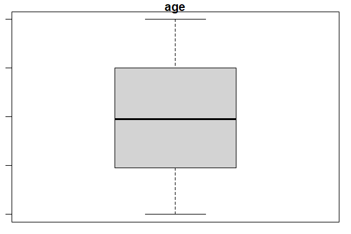

Business Intelligence Project
================

- [Student Details](#student-details)
- [Setup Chunk](#setup-chunk)
- [Load dataset](#load-dataset)
- [Exploratory Data Analysis](#exploratory-data-analysis)
  - [Dimensions](#dimensions)
  - [Data Types](#data-types)
  - [Descriptive Statistics](#descriptive-statistics)
    - [Measures of Frequency](#measures-of-frequency)
    - [Measures of Central Tendency](#measures-of-central-tendency)
  - [Measures of
    Distribution/Dispersion/Spread/Scatter/Variability](#measures-of-distributiondispersionspreadscattervariability)
    - [Measure the distribution of the data for each
      variable](#measure-the-distribution-of-the-data-for-each-variable)
    - [Measure the standard deviation of each
      variable](#measure-the-standard-deviation-of-each-variable)
    - [Measure the variance of each
      variable](#measure-the-variance-of-each-variable)
    - [Measure the kurtosis of each
      variable](#measure-the-kurtosis-of-each-variable)
    - [Measure the skewness of each
      variable](#measure-the-skewness-of-each-variable)
  - [Measures of Relationship](#measures-of-relationship)
    - [Measure the covariance between
      variables](#measure-the-covariance-between-variables)
    - [Measure the correlation between
      variables](#measure-the-correlation-between-variables)
  - [Inferential Statistics](#inferential-statistics)
    - [Perform ANOVA](#perform-anova)
      - [One-Way ANOVA](#one-way-anova)
      - [Two-Way ANOVA](#two-way-anova)
  - [Qualitative Data Analysis](#qualitative-data-analysis)
    - [Univariate plots](#univariate-plots)
      - [Create histograms](#create-histograms)
      - [Create Box and Whisker Plots for Each Numeric
        Attribute](#create-box-and-whisker-plots-for-each-numeric-attribute)
      - [Create a Missingness Map to Identify Missing
        Data](#create-a-missingness-map-to-identify-missing-data)
    - [Multivariate Plots](#multivariate-plots)
      - [Create a Correlation Plot](#create-a-correlation-plot)
- [Data Imputation](#data-imputation)
  - [Are there missing values in the
    dataset?](#are-there-missing-values-in-the-dataset)
  - [How many?](#how-many)
  - [What is the proportion of missing data in the entire
    dataset?](#what-is-the-proportion-of-missing-data-in-the-entire-dataset)
  - [How many missing values does each variable
    have?](#how-many-missing-values-does-each-variable-have)
  - [What is the number and percentage of missing values grouped by each
    variable?](#what-is-the-number-and-percentage-of-missing-values-grouped-by-each-variable)
  - [What is the number and percentage of missing values grouped by each
    observation?](#what-is-the-number-and-percentage-of-missing-values-grouped-by-each-observation)
  - [Which variables contain the most missing
    values?](#which-variables-contain-the-most-missing-values)
  - [Remove the observations with missing
    values](#remove-the-observations-with-missing-values)
- [Data transformation](#data-transformation)
  - [The Scale Basic Transform](#the-scale-basic-transform)
    - [Before](#before)
    - [After](#after)
  - [Center Data Transform](#center-data-transform)
  - [Standardize Data Transform](#standardize-data-transform)
    - [Before](#before-1)
    - [After](#after-1)
  - [Normalize Data Transform](#normalize-data-transform)
  - [Box-Cox Power Transform](#box-cox-power-transform)
    - [Before](#before-2)
    - [After](#after-2)
  - [Yeo-Johnson Power Transform](#yeo-johnson-power-transform)
    - [Before](#before-3)
    - [After](#after-3)
  - [PCA for Dimensionality
    Reduction](#pca-for-dimensionality-reduction)
  - [PCA for Feature Extraction](#pca-for-feature-extraction)
    - [Scree Plot](#scree-plot)
    - [Loading Values](#loading-values)
    - [Biplot and Cos2 Combined Plot](#biplot-and-cos2-combined-plot)
  - [ICA for Dimensionality Reduction on the Boston Housing
    Dataset](#ica-for-dimensionality-reduction-on-the-boston-housing-dataset)

# Student Details

|                                              |                             |
|----------------------------------------------|-----------------------------|
| **Student ID Number**                        | 119630,135844,131038,104135 |
| **Student Name**                             | beasts                      |
| **BBIT 4.2 Group**                           | A&B&C                       |
| **BI Project Group Name/ID (if applicable)** | beasts                      |

# Setup Chunk

**Note:** the following KnitR options have been set as the global
defaults: <BR>
`knitr::opts_chunk$set(echo = TRUE, warning = FALSE, eval = TRUE, collapse = FALSE, tidy = TRUE)`.

More KnitR options are documented here
<https://bookdown.org/yihui/rmarkdown-cookbook/chunk-options.html> and
here <https://yihui.org/knitr/options/>.

# Load dataset

``` r
insurance <- read.csv("data/insurance_info.csv")
```

# Exploratory Data Analysis

## Dimensions

``` r
dim(insurance)
```

    ## [1] 19999     9

## Data Types

``` r
sapply(insurance, class)
```

    ## insurance.name   packagePrice       services      priceRage    packageType 
    ##    "character"      "integer"    "character"    "character"    "character" 
    ##            age     preIllness         rating  transactionNo 
    ##      "integer"    "character"      "numeric"    "character"

## Descriptive Statistics

### Measures of Frequency

``` r
insurance_rating_freq <- insurance$rating
cbind(frequency = table(insurance_rating_freq),
      percentage = prop.table(table(insurance_rating_freq)) * 100)
```

    ##     frequency percentage
    ## 1         263   1.315066
    ## 1.1       522   2.610131
    ## 1.2       519   2.595130
    ## 1.3       523   2.615131
    ## 1.4       505   2.525126
    ## 1.5       506   2.530127
    ## 1.6       502   2.510126
    ## 1.7       467   2.335117
    ## 1.8       493   2.465123
    ## 1.9       466   2.330117
    ## 2         505   2.525126
    ## 2.1       505   2.525126
    ## 2.2       492   2.460123
    ## 2.3       494   2.470124
    ## 2.4       510   2.550128
    ## 2.5       506   2.530127
    ## 2.6       494   2.470124
    ## 2.7       479   2.395120
    ## 2.8       498   2.490125
    ## 2.9       506   2.530127
    ## 3         525   2.625131
    ## 3.1       516   2.580129
    ## 3.2       486   2.430122
    ## 3.3       533   2.665133
    ## 3.4       479   2.395120
    ## 3.5       504   2.520126
    ## 3.6       481   2.405120
    ## 3.7       520   2.600130
    ## 3.8       503   2.515126
    ## 3.9       530   2.650133
    ## 4         484   2.420121
    ## 4.1       460   2.300115
    ## 4.2       471   2.355118
    ## 4.3       483   2.415121
    ## 4.4       505   2.525126
    ## 4.5       486   2.430122
    ## 4.6       520   2.600130
    ## 4.7       510   2.550128
    ## 4.8       518   2.590130
    ## 4.9       492   2.460123
    ## 5         238   1.190060

### Measures of Central Tendency

``` r
insurance_rating_mode <- names(table(insurance$rating))[
  which(table(insurance$rating) == max(table(insurance$rating)))
]
print(insurance_rating_mode)
```

    ## [1] "3.3"

## Measures of Distribution/Dispersion/Spread/Scatter/Variability

### Measure the distribution of the data for each variable

``` r
summary(insurance)
```

    ##  insurance.name      packagePrice      services          priceRage        
    ##  Length:19999       Min.   :  6001   Length:19999       Length:19999      
    ##  Class :character   1st Qu.: 40045   Class :character   Class :character  
    ##  Mode  :character   Median : 73103   Mode  :character   Mode  :character  
    ##                     Mean   : 72979                                        
    ##                     3rd Qu.:106008                                        
    ##                     Max.   :140000                                        
    ##                     NA's   :1390                                          
    ##  packageType             age        preIllness            rating     
    ##  Length:19999       Min.   : 0.0   Length:19999       Min.   :1.000  
    ##  Class :character   1st Qu.:19.0   Class :character   1st Qu.:2.000  
    ##  Mode  :character   Median :39.0   Mode  :character   Median :3.000  
    ##                     Mean   :39.7                      Mean   :2.994  
    ##                     3rd Qu.:60.0                      3rd Qu.:4.000  
    ##                     Max.   :80.0                      Max.   :5.000  
    ##                                                                      
    ##  transactionNo     
    ##  Length:19999      
    ##  Class :character  
    ##  Mode  :character  
    ##                    
    ##                    
    ##                    
    ## 

### Measure the standard deviation of each variable

``` r
library(e1071)

sapply(insurance[, c(6,8)], sd)
```

    ##       age    rating 
    ## 23.322165  1.158061

### Measure the variance of each variable

``` r
sapply(insurance[, c(6,8)], var)
```

    ##        age     rating 
    ## 543.923379   1.341106

### Measure the kurtosis of each variable

``` r
library(e1071)

sapply(insurance[, c(6, 8)], kurtosis, type = 2)
```

    ##       age    rating 
    ## -1.196755 -1.193846

### Measure the skewness of each variable

``` r
sapply(insurance[, c(6, 8)],  skewness, type = 2)
```

    ##          age       rating 
    ## 0.0243797733 0.0009158415

## Measures of Relationship

### Measure the covariance between variables

``` r
insurance_cov <- cov(insurance[, c(6, 8)])
View(insurance_cov)
```

### Measure the correlation between variables

``` r
insurance_cor <- cor(insurance[, c(6, 8)])
View(insurance_cor)
```

## Inferential Statistics

### Perform ANOVA

#### One-Way ANOVA

``` r
insurance_one_way_anova <- aov(age ~ rating, data = insurance)
summary(insurance_one_way_anova)
```

    ##                Df   Sum Sq Mean Sq F value Pr(>F)  
    ## rating          1     1524  1523.6   2.801 0.0942 .
    ## Residuals   19997 10875856   543.9                 
    ## ---
    ## Signif. codes:  0 '***' 0.001 '**' 0.01 '*' 0.05 '.' 0.1 ' ' 1

#### Two-Way ANOVA

``` r
insurance_two_way_anova <- aov(packagePrice ~ rating + age, # nolint
                                           data = insurance)
summary(insurance_two_way_anova)
```

    ##                Df    Sum Sq   Mean Sq F value Pr(>F)
    ## rating          1 1.738e+08 1.738e+08   0.117  0.732
    ## age             1 2.906e+09 2.906e+09   1.956  0.162
    ## Residuals   18606 2.764e+13 1.486e+09               
    ## 1390 observations deleted due to missingness

## Qualitative Data Analysis

### Univariate plots

#### Create histograms

``` r
insurance_age <- as.numeric(unlist(insurance[, 6]))
hist(insurance_age, main = names(insurance)[6])
```

<!-- -->

#### Create Box and Whisker Plots for Each Numeric Attribute

``` r
par(mar = c(3, 3, 1, 1))

boxplot(insurance[, 6], main = names(insurance)[6])
```

<!-- -->

``` r
boxplot(insurance[, 2], main = names(insurance)[2])
```

<!-- -->

``` r
boxplot(insurance[, 8], main = names(insurance)[8])
```

<!-- -->

#### Create a Missingness Map to Identify Missing Data

``` r
library(Amelia)
```

    ## Loading required package: Rcpp

    ## ## 
    ## ## Amelia II: Multiple Imputation
    ## ## (Version 1.8.1, built: 2022-11-18)
    ## ## Copyright (C) 2005-2023 James Honaker, Gary King and Matthew Blackwell
    ## ## Refer to http://gking.harvard.edu/amelia/ for more information
    ## ##

``` r
missmap(insurance, col = c("red", "grey"), legend = TRUE)
```

<!-- -->

### Multivariate Plots

#### Create a Correlation Plot

``` r
library(corrplot)
```

    ## corrplot 0.92 loaded

``` r
corrplot(cor(insurance[, c(6, 8)]), method = "circle")
```

<!-- -->

# Data Imputation

### Are there missing values in the dataset?

``` r
library(tidyverse)
```

    ## ── Attaching core tidyverse packages ──────────────────────── tidyverse 2.0.0 ──
    ## ✔ dplyr     1.1.4     ✔ readr     2.1.4
    ## ✔ forcats   1.0.0     ✔ stringr   1.5.1
    ## ✔ ggplot2   3.4.4     ✔ tibble    3.2.1
    ## ✔ lubridate 1.9.3     ✔ tidyr     1.3.0
    ## ✔ purrr     1.0.2     
    ## ── Conflicts ────────────────────────────────────────── tidyverse_conflicts() ──
    ## ✖ dplyr::filter() masks stats::filter()
    ## ✖ dplyr::lag()    masks stats::lag()
    ## ℹ Use the conflicted package (<http://conflicted.r-lib.org/>) to force all conflicts to become errors

``` r
anyNA(insurance)
```

    ## [1] TRUE

### How many?

``` r
library(naniar)

n_miss(insurance)
```

    ## [1] 1390

### What is the proportion of missing data in the entire dataset?

``` r
prop_miss(insurance)
```

    ## [1] 0.007722608

### How many missing values does each variable have?

``` r
insurance %>% is.na() %>% colSums()
```

    ## insurance.name   packagePrice       services      priceRage    packageType 
    ##              0           1390              0              0              0 
    ##            age     preIllness         rating  transactionNo 
    ##              0              0              0              0

### What is the number and percentage of missing values grouped by each variable?

``` r
miss_var_summary(insurance)
```

    ## # A tibble: 9 × 3
    ##   variable       n_miss pct_miss
    ##   <chr>           <int>    <dbl>
    ## 1 packagePrice     1390     6.95
    ## 2 insurance.name      0     0   
    ## 3 services            0     0   
    ## 4 priceRage           0     0   
    ## 5 packageType         0     0   
    ## 6 age                 0     0   
    ## 7 preIllness          0     0   
    ## 8 rating              0     0   
    ## 9 transactionNo       0     0

### What is the number and percentage of missing values grouped by each observation?

``` r
miss_case_summary(insurance)
```

    ## # A tibble: 19,999 × 3
    ##     case n_miss pct_miss
    ##    <int>  <int>    <dbl>
    ##  1   217      1     11.1
    ##  2   302      1     11.1
    ##  3   304      1     11.1
    ##  4   381      1     11.1
    ##  5   418      1     11.1
    ##  6   424      1     11.1
    ##  7   642      1     11.1
    ##  8   982      1     11.1
    ##  9  1045      1     11.1
    ## 10  1159      1     11.1
    ## # ℹ 19,989 more rows

### Which variables contain the most missing values?

``` r
gg_miss_var(insurance)
```

<!-- -->

## Remove the observations with missing values

``` r
insurance_obs <- insurance %>% filter(complete.cases(.))
dim(insurance_obs)
```

    ## [1] 18609     9

# Data transformation

### The Scale Basic Transform

#### Before

``` r
library(caret)
```

    ## Loading required package: lattice

    ## 
    ## Attaching package: 'caret'

    ## The following object is masked from 'package:purrr':
    ## 
    ##     lift

``` r
summary(insurance_obs)
```

    ##  insurance.name      packagePrice      services          priceRage        
    ##  Length:18609       Min.   :  6001   Length:18609       Length:18609      
    ##  Class :character   1st Qu.: 40045   Class :character   Class :character  
    ##  Mode  :character   Median : 73103   Mode  :character   Mode  :character  
    ##                     Mean   : 72979                                        
    ##                     3rd Qu.:106008                                        
    ##                     Max.   :140000                                        
    ##  packageType             age         preIllness            rating 
    ##  Length:18609       Min.   : 0.00   Length:18609       Min.   :1  
    ##  Class :character   1st Qu.:20.00   Class :character   1st Qu.:2  
    ##  Mode  :character   Median :40.00   Mode  :character   Median :3  
    ##                     Mean   :39.73                      Mean   :3  
    ##                     3rd Qu.:60.00                      3rd Qu.:4  
    ##                     Max.   :80.00                      Max.   :5  
    ##  transactionNo     
    ##  Length:18609      
    ##  Class :character  
    ##  Mode  :character  
    ##                    
    ##                    
    ## 

``` r
insurance_obs_yield <- as.numeric(unlist(insurance_obs[, 8]))
hist(insurance_obs_yield, main = names(insurance_obs)[8])
```

<!-- -->

``` r
model_of_the_transform <- preProcess(insurance_obs, method = c("scale"))
print(model_of_the_transform)
```

    ## Created from 18609 samples and 9 variables
    ## 
    ## Pre-processing:
    ##   - ignored (6)
    ##   - scaled (3)

``` r
insurance_scale_transform <- predict(model_of_the_transform, insurance_obs)
```

#### After

``` r
summary(insurance_scale_transform)
```

    ##  insurance.name      packagePrice      services          priceRage        
    ##  Length:18609       Min.   :0.1557   Length:18609       Length:18609      
    ##  Class :character   1st Qu.:1.0389   Class :character   Class :character  
    ##  Mode  :character   Median :1.8966   Mode  :character   Mode  :character  
    ##                     Mean   :1.8934                                        
    ##                     3rd Qu.:2.7502                                        
    ##                     Max.   :3.6321                                        
    ##  packageType             age          preIllness            rating      
    ##  Length:18609       Min.   :0.0000   Length:18609       Min.   :0.8631  
    ##  Class :character   1st Qu.:0.8584   Class :character   1st Qu.:1.7261  
    ##  Mode  :character   Median :1.7167   Mode  :character   Median :2.5892  
    ##                     Mean   :1.7050                      Mean   :2.5893  
    ##                     3rd Qu.:2.5751                      3rd Qu.:3.4523  
    ##                     Max.   :3.4334                      Max.   :4.3154  
    ##  transactionNo     
    ##  Length:18609      
    ##  Class :character  
    ##  Mode  :character  
    ##                    
    ##                    
    ## 

``` r
insurance_obs_yield <- as.numeric(unlist(insurance_scale_transform[, 8]))
hist(insurance_obs_yield, main = names(insurance_scale_transform)[8])
```

<!-- -->

### Center Data Transform

``` r
summary(insurance_obs)
```

    ##  insurance.name      packagePrice      services          priceRage        
    ##  Length:18609       Min.   :  6001   Length:18609       Length:18609      
    ##  Class :character   1st Qu.: 40045   Class :character   Class :character  
    ##  Mode  :character   Median : 73103   Mode  :character   Mode  :character  
    ##                     Mean   : 72979                                        
    ##                     3rd Qu.:106008                                        
    ##                     Max.   :140000                                        
    ##  packageType             age         preIllness            rating 
    ##  Length:18609       Min.   : 0.00   Length:18609       Min.   :1  
    ##  Class :character   1st Qu.:20.00   Class :character   1st Qu.:2  
    ##  Mode  :character   Median :40.00   Mode  :character   Median :3  
    ##                     Mean   :39.73                      Mean   :3  
    ##                     3rd Qu.:60.00                      3rd Qu.:4  
    ##                     Max.   :80.00                      Max.   :5  
    ##  transactionNo     
    ##  Length:18609      
    ##  Class :character  
    ##  Mode  :character  
    ##                    
    ##                    
    ## 

``` r
model_of_the_transform <- preProcess(insurance_obs, method = c("center"))
print(model_of_the_transform)
```

    ## Created from 18609 samples and 9 variables
    ## 
    ## Pre-processing:
    ##   - centered (3)
    ##   - ignored (6)

``` r
insurance_center_transform <- predict(model_of_the_transform, insurance_obs)
summary(insurance_center_transform)
```

    ##  insurance.name      packagePrice        services          priceRage        
    ##  Length:18609       Min.   :-66978.5   Length:18609       Length:18609      
    ##  Class :character   1st Qu.:-32934.5   Class :character   Class :character  
    ##  Mode  :character   Median :   123.5   Mode  :character   Mode  :character  
    ##                     Mean   :     0.0                                        
    ##                     3rd Qu.: 33028.5                                        
    ##                     Max.   : 67020.5                                        
    ##  packageType             age            preIllness            rating          
    ##  Length:18609       Min.   :-39.7264   Length:18609       Min.   :-2.0001182  
    ##  Class :character   1st Qu.:-19.7264   Class :character   1st Qu.:-1.0001182  
    ##  Mode  :character   Median :  0.2736   Mode  :character   Median :-0.0001182  
    ##                     Mean   :  0.0000                      Mean   : 0.0000000  
    ##                     3rd Qu.: 20.2736                      3rd Qu.: 0.9998818  
    ##                     Max.   : 40.2736                      Max.   : 1.9998818  
    ##  transactionNo     
    ##  Length:18609      
    ##  Class :character  
    ##  Mode  :character  
    ##                    
    ##                    
    ## 

### Standardize Data Transform

#### Before

``` r
summary(insurance_obs)
```

    ##  insurance.name      packagePrice      services          priceRage        
    ##  Length:18609       Min.   :  6001   Length:18609       Length:18609      
    ##  Class :character   1st Qu.: 40045   Class :character   Class :character  
    ##  Mode  :character   Median : 73103   Mode  :character   Mode  :character  
    ##                     Mean   : 72979                                        
    ##                     3rd Qu.:106008                                        
    ##                     Max.   :140000                                        
    ##  packageType             age         preIllness            rating 
    ##  Length:18609       Min.   : 0.00   Length:18609       Min.   :1  
    ##  Class :character   1st Qu.:20.00   Class :character   1st Qu.:2  
    ##  Mode  :character   Median :40.00   Mode  :character   Median :3  
    ##                     Mean   :39.73                      Mean   :3  
    ##                     3rd Qu.:60.00                      3rd Qu.:4  
    ##                     Max.   :80.00                      Max.   :5  
    ##  transactionNo     
    ##  Length:18609      
    ##  Class :character  
    ##  Mode  :character  
    ##                    
    ##                    
    ## 

``` r
sapply(insurance_obs[, c(6,8)], sd)
```

    ##       age    rating 
    ## 23.300216  1.158651

``` r
model_of_the_transform <- preProcess(insurance_obs,
                                     method = c("scale", "center"))
print(model_of_the_transform)
```

    ## Created from 18609 samples and 9 variables
    ## 
    ## Pre-processing:
    ##   - centered (3)
    ##   - ignored (6)
    ##   - scaled (3)

``` r
insurance_standardize_transform <- predict(model_of_the_transform, insurance_obs) # nolint
```

#### After

``` r
summary(insurance_standardize_transform)
```

    ##  insurance.name      packagePrice         services          priceRage        
    ##  Length:18609       Min.   :-1.737675   Length:18609       Length:18609      
    ##  Class :character   1st Qu.:-0.854445   Class :character   Class :character  
    ##  Mode  :character   Median : 0.003204   Mode  :character   Mode  :character  
    ##                     Mean   : 0.000000                                        
    ##                     3rd Qu.: 0.856884                                        
    ##                     Max.   : 1.738765                                        
    ##  packageType             age            preIllness            rating         
    ##  Length:18609       Min.   :-1.70498   Length:18609       Min.   :-1.726247  
    ##  Class :character   1st Qu.:-0.84662   Class :character   1st Qu.:-0.863174  
    ##  Mode  :character   Median : 0.01174   Mode  :character   Median :-0.000102  
    ##                     Mean   : 0.00000                      Mean   : 0.000000  
    ##                     3rd Qu.: 0.87010                      3rd Qu.: 0.862970  
    ##                     Max.   : 1.72846                      Max.   : 1.726043  
    ##  transactionNo     
    ##  Length:18609      
    ##  Class :character  
    ##  Mode  :character  
    ##                    
    ##                    
    ## 

``` r
sapply(insurance_standardize_transform[, c(6,8)], sd)
```

    ##    age rating 
    ##      1      1

### Normalize Data Transform

``` r
summary(insurance_obs)
```

    ##  insurance.name      packagePrice      services          priceRage        
    ##  Length:18609       Min.   :  6001   Length:18609       Length:18609      
    ##  Class :character   1st Qu.: 40045   Class :character   Class :character  
    ##  Mode  :character   Median : 73103   Mode  :character   Mode  :character  
    ##                     Mean   : 72979                                        
    ##                     3rd Qu.:106008                                        
    ##                     Max.   :140000                                        
    ##  packageType             age         preIllness            rating 
    ##  Length:18609       Min.   : 0.00   Length:18609       Min.   :1  
    ##  Class :character   1st Qu.:20.00   Class :character   1st Qu.:2  
    ##  Mode  :character   Median :40.00   Mode  :character   Median :3  
    ##                     Mean   :39.73                      Mean   :3  
    ##                     3rd Qu.:60.00                      3rd Qu.:4  
    ##                     Max.   :80.00                      Max.   :5  
    ##  transactionNo     
    ##  Length:18609      
    ##  Class :character  
    ##  Mode  :character  
    ##                    
    ##                    
    ## 

``` r
model_of_the_transform <- preProcess(insurance_obs, method = c("range"))
print(model_of_the_transform)
```

    ## Created from 18609 samples and 9 variables
    ## 
    ## Pre-processing:
    ##   - ignored (6)
    ##   - re-scaling to [0, 1] (3)

``` r
insurance_normalize_transform <- predict(model_of_the_transform, insurance_obs)
summary(insurance_normalize_transform)
```

    ##  insurance.name      packagePrice      services          priceRage        
    ##  Length:18609       Min.   :0.0000   Length:18609       Length:18609      
    ##  Class :character   1st Qu.:0.2541   Class :character   Class :character  
    ##  Mode  :character   Median :0.5008   Mode  :character   Mode  :character  
    ##                     Mean   :0.4998                                        
    ##                     3rd Qu.:0.7463                                        
    ##                     Max.   :1.0000                                        
    ##  packageType             age          preIllness            rating    
    ##  Length:18609       Min.   :0.0000   Length:18609       Min.   :0.00  
    ##  Class :character   1st Qu.:0.2500   Class :character   1st Qu.:0.25  
    ##  Mode  :character   Median :0.5000   Mode  :character   Median :0.50  
    ##                     Mean   :0.4966                      Mean   :0.50  
    ##                     3rd Qu.:0.7500                      3rd Qu.:0.75  
    ##                     Max.   :1.0000                      Max.   :1.00  
    ##  transactionNo     
    ##  Length:18609      
    ##  Class :character  
    ##  Mode  :character  
    ##                    
    ##                    
    ## 

### Box-Cox Power Transform

#### Before

``` r
library(e1071)

summary(insurance_standardize_transform)
```

    ##  insurance.name      packagePrice         services          priceRage        
    ##  Length:18609       Min.   :-1.737675   Length:18609       Length:18609      
    ##  Class :character   1st Qu.:-0.854445   Class :character   Class :character  
    ##  Mode  :character   Median : 0.003204   Mode  :character   Mode  :character  
    ##                     Mean   : 0.000000                                        
    ##                     3rd Qu.: 0.856884                                        
    ##                     Max.   : 1.738765                                        
    ##  packageType             age            preIllness            rating         
    ##  Length:18609       Min.   :-1.70498   Length:18609       Min.   :-1.726247  
    ##  Class :character   1st Qu.:-0.84662   Class :character   1st Qu.:-0.863174  
    ##  Mode  :character   Median : 0.01174   Mode  :character   Median :-0.000102  
    ##                     Mean   : 0.00000                      Mean   : 0.000000  
    ##                     3rd Qu.: 0.87010                      3rd Qu.: 0.862970  
    ##                     Max.   : 1.72846                      Max.   : 1.726043  
    ##  transactionNo     
    ##  Length:18609      
    ##  Class :character  
    ##  Mode  :character  
    ##                    
    ##                    
    ## 

``` r
# Calculate the skewness before the Box-Cox transform
sapply(insurance_standardize_transform[, c(6,8)],  skewness, type = 2)
```

    ##          age       rating 
    ##  0.022104056 -0.005857596

``` r
sapply(insurance_standardize_transform[, c(6,8)], sd)
```

    ##    age rating 
    ##      1      1

``` r
model_of_the_transform <- preProcess(insurance_standardize_transform,
                                     method = c("BoxCox"))
print(model_of_the_transform)
```

    ## Created from 18609 samples and 6 variables
    ## 
    ## Pre-processing:
    ##   - ignored (6)

``` r
insurance_box_cox_transform <- predict(model_of_the_transform,
                                       insurance_standardize_transform)
```

#### After

``` r
summary(insurance_box_cox_transform)
```

    ##  insurance.name      packagePrice         services          priceRage        
    ##  Length:18609       Min.   :-1.737675   Length:18609       Length:18609      
    ##  Class :character   1st Qu.:-0.854445   Class :character   Class :character  
    ##  Mode  :character   Median : 0.003204   Mode  :character   Mode  :character  
    ##                     Mean   : 0.000000                                        
    ##                     3rd Qu.: 0.856884                                        
    ##                     Max.   : 1.738765                                        
    ##  packageType             age            preIllness            rating         
    ##  Length:18609       Min.   :-1.70498   Length:18609       Min.   :-1.726247  
    ##  Class :character   1st Qu.:-0.84662   Class :character   1st Qu.:-0.863174  
    ##  Mode  :character   Median : 0.01174   Mode  :character   Median :-0.000102  
    ##                     Mean   : 0.00000                      Mean   : 0.000000  
    ##                     3rd Qu.: 0.87010                      3rd Qu.: 0.862970  
    ##                     Max.   : 1.72846                      Max.   : 1.726043  
    ##  transactionNo     
    ##  Length:18609      
    ##  Class :character  
    ##  Mode  :character  
    ##                    
    ##                    
    ## 

``` r
sapply(insurance_box_cox_transform[, c(6,8)],  skewness, type = 2)
```

    ##          age       rating 
    ##  0.022104056 -0.005857596

``` r
sapply(insurance_box_cox_transform[, c(6,8)], sd)
```

    ##    age rating 
    ##      1      1

``` r
# Calculate the skewness after the Box-Cox transform
sapply(insurance_box_cox_transform[, c(6,8)],  skewness, type = 2)
```

    ##          age       rating 
    ##  0.022104056 -0.005857596

``` r
sapply(insurance_box_cox_transform[, c(6,8)], sd)
```

    ##    age rating 
    ##      1      1

### Yeo-Johnson Power Transform

#### Before

``` r
summary(insurance_standardize_transform)
```

    ##  insurance.name      packagePrice         services          priceRage        
    ##  Length:18609       Min.   :-1.737675   Length:18609       Length:18609      
    ##  Class :character   1st Qu.:-0.854445   Class :character   Class :character  
    ##  Mode  :character   Median : 0.003204   Mode  :character   Mode  :character  
    ##                     Mean   : 0.000000                                        
    ##                     3rd Qu.: 0.856884                                        
    ##                     Max.   : 1.738765                                        
    ##  packageType             age            preIllness            rating         
    ##  Length:18609       Min.   :-1.70498   Length:18609       Min.   :-1.726247  
    ##  Class :character   1st Qu.:-0.84662   Class :character   1st Qu.:-0.863174  
    ##  Mode  :character   Median : 0.01174   Mode  :character   Median :-0.000102  
    ##                     Mean   : 0.00000                      Mean   : 0.000000  
    ##                     3rd Qu.: 0.87010                      3rd Qu.: 0.862970  
    ##                     Max.   : 1.72846                      Max.   : 1.726043  
    ##  transactionNo     
    ##  Length:18609      
    ##  Class :character  
    ##  Mode  :character  
    ##                    
    ##                    
    ## 

``` r
# Calculate the skewness before the Yeo-Johnson transform
sapply(insurance_standardize_transform[, c(6,8)],  skewness, type = 2)
```

    ##          age       rating 
    ##  0.022104056 -0.005857596

``` r
sapply(insurance_standardize_transform[, c(6,8)], sd)
```

    ##    age rating 
    ##      1      1

``` r
model_of_the_transform <- preProcess(insurance_standardize_transform,
                                     method = c("YeoJohnson"))
print(model_of_the_transform)
```

    ## Created from 18609 samples and 9 variables
    ## 
    ## Pre-processing:
    ##   - ignored (6)
    ##   - Yeo-Johnson transformation (3)
    ## 
    ## Lambda estimates for Yeo-Johnson transformation:
    ## 1, 0.98, 1.01

``` r
insurance_yeo_johnson_transform <- predict(model_of_the_transform, # nolint
                                           insurance_standardize_transform)
```

#### After

``` r
summary(insurance_yeo_johnson_transform)
```

    ##  insurance.name      packagePrice          services          priceRage        
    ##  Length:18609       Min.   :-1.7370805   Length:18609       Length:18609      
    ##  Class :character   1st Qu.:-0.8542754   Class :character   Class :character  
    ##  Mode  :character   Median : 0.0032042   Mode  :character   Mode  :character  
    ##                     Mean   : 0.0002135                                        
    ##                     3rd Qu.: 0.8570543                                        
    ##                     Max.   : 1.7393593                                        
    ##  packageType             age             preIllness            rating         
    ##  Length:18609       Min.   :-1.726163   Length:18609       Min.   :-1.720077  
    ##  Class :character   1st Qu.:-0.852741   Class :character   1st Qu.:-0.861359  
    ##  Mode  :character   Median : 0.011740   Mode  :character   Median :-0.000102  
    ##                     Mean   :-0.007806                      Mean   : 0.002248  
    ##                     3rd Qu.: 0.863729                      3rd Qu.: 0.864789  
    ##                     Max.   : 1.707107                      Max.   : 1.732239  
    ##  transactionNo     
    ##  Length:18609      
    ##  Class :character  
    ##  Mode  :character  
    ##                    
    ##                    
    ## 

``` r
# Calculate the skewness after the Yeo-Johnson transform
sapply(insurance_yeo_johnson_transform[, c(6,8)],  skewness, type = 2)
```

    ##           age        rating 
    ##  0.0044536403 -0.0007765162

``` r
sapply(insurance_yeo_johnson_transform[, c(6,8)], sd)
```

    ##       age    rating 
    ## 0.9999392 0.9999956

### PCA for Dimensionality Reduction

``` r
summary(insurance)
```

    ##  insurance.name      packagePrice      services          priceRage        
    ##  Length:19999       Min.   :  6001   Length:19999       Length:19999      
    ##  Class :character   1st Qu.: 40045   Class :character   Class :character  
    ##  Mode  :character   Median : 73103   Mode  :character   Mode  :character  
    ##                     Mean   : 72979                                        
    ##                     3rd Qu.:106008                                        
    ##                     Max.   :140000                                        
    ##                     NA's   :1390                                          
    ##  packageType             age        preIllness            rating     
    ##  Length:19999       Min.   : 0.0   Length:19999       Min.   :1.000  
    ##  Class :character   1st Qu.:19.0   Class :character   1st Qu.:2.000  
    ##  Mode  :character   Median :39.0   Mode  :character   Median :3.000  
    ##                     Mean   :39.7                      Mean   :2.994  
    ##                     3rd Qu.:60.0                      3rd Qu.:4.000  
    ##                     Max.   :80.0                      Max.   :5.000  
    ##                                                                      
    ##  transactionNo     
    ##  Length:19999      
    ##  Class :character  
    ##  Mode  :character  
    ##                    
    ##                    
    ##                    
    ## 

``` r
model_of_the_transform <- preProcess(insurance, method =
                                       c("scale", "center", "pca"))

print(model_of_the_transform)
```

    ## Created from 18609 samples and 9 variables
    ## 
    ## Pre-processing:
    ##   - centered (3)
    ##   - ignored (6)
    ##   - principal component signal extraction (3)
    ##   - scaled (3)
    ## 
    ## PCA needed 3 components to capture 95 percent of the variance

``` r
insurance_pca_dr <- predict(model_of_the_transform, insurance)

summary(insurance_pca_dr)
```

    ##  insurance.name       services          priceRage         packageType       
    ##  Length:19999       Length:19999       Length:19999       Length:19999      
    ##  Class :character   Class :character   Class :character   Class :character  
    ##  Mode  :character   Mode  :character   Mode  :character   Mode  :character  
    ##                                                                             
    ##                                                                             
    ##                                                                             
    ##                                                                             
    ##   preIllness        transactionNo           PC1               PC2         
    ##  Length:19999       Length:19999       Min.   :-2.8351   Min.   :-2.4581  
    ##  Class :character   Class :character   1st Qu.:-0.7251   1st Qu.:-0.7312  
    ##  Mode  :character   Mode  :character   Median : 0.0004   Median :-0.0052  
    ##                                        Mean   : 0.0040   Mean   :-0.0034  
    ##                                        3rd Qu.: 0.7262   3rd Qu.: 0.7218  
    ##                                        Max.   : 2.8376   Max.   : 2.4555  
    ##                                        NA's   :1390      NA's   :1390     
    ##       PC3         
    ##  Min.   :-2.7721  
    ##  1st Qu.:-0.7103  
    ##  Median :-0.0034  
    ##  Mean   : 0.0021  
    ##  3rd Qu.: 0.7302  
    ##  Max.   : 2.8666  
    ##  NA's   :1390

### PCA for Feature Extraction

``` r
insurance_pca_fe <- princomp(cor(insurance[, c(6,8)]))
summary(insurance_pca_fe)
```

    ## Importance of components:
    ##                          Comp.1 Comp.2
    ## Standard deviation     0.698738      0
    ## Proportion of Variance 1.000000      0
    ## Cumulative Proportion  1.000000      1

#### Scree Plot

``` r
factoextra::fviz_eig(insurance_pca_fe, addlabels = TRUE)
```

<!-- -->

#### Loading Values

``` r
insurance_pca_fe$rating[, 1:2]
```

    ## NULL

``` r
factoextra::fviz_cos2(insurance_pca_fe, choice = "var", axes = 1:2)
```

<!-- -->

#### Biplot and Cos2 Combined Plot

``` r
factoextra::fviz_pca_var(insurance_pca_fe, col.var = "cos2",
                         gradient.cols = c("red", "orange", "green"),
                         repel = TRUE)
```

<!-- -->

### ICA for Dimensionality Reduction on the Boston Housing Dataset

``` r
summary(insurance)
```

    ##  insurance.name      packagePrice      services          priceRage        
    ##  Length:19999       Min.   :  6001   Length:19999       Length:19999      
    ##  Class :character   1st Qu.: 40045   Class :character   Class :character  
    ##  Mode  :character   Median : 73103   Mode  :character   Mode  :character  
    ##                     Mean   : 72979                                        
    ##                     3rd Qu.:106008                                        
    ##                     Max.   :140000                                        
    ##                     NA's   :1390                                          
    ##  packageType             age        preIllness            rating     
    ##  Length:19999       Min.   : 0.0   Length:19999       Min.   :1.000  
    ##  Class :character   1st Qu.:19.0   Class :character   1st Qu.:2.000  
    ##  Mode  :character   Median :39.0   Mode  :character   Median :3.000  
    ##                     Mean   :39.7                      Mean   :2.994  
    ##                     3rd Qu.:60.0                      3rd Qu.:4.000  
    ##                     Max.   :80.0                      Max.   :5.000  
    ##                                                                      
    ##  transactionNo     
    ##  Length:19999      
    ##  Class :character  
    ##  Mode  :character  
    ##                    
    ##                    
    ##                    
    ## 

``` r
model_of_the_transform <- preProcess(insurance,
                                     method = c("scale", "center", "ica"),
                                     n.comp = 3)
print(model_of_the_transform)
```

    ## Created from 18609 samples and 9 variables
    ## 
    ## Pre-processing:
    ##   - centered (3)
    ##   - independent component signal extraction (3)
    ##   - ignored (6)
    ##   - scaled (3)
    ## 
    ## ICA used 3 components

``` r
insurance_ica_dr <- predict(model_of_the_transform, insurance)

summary(insurance_ica_dr)
```

    ##  insurance.name       services          priceRage         packageType       
    ##  Length:19999       Length:19999       Length:19999       Length:19999      
    ##  Class :character   Class :character   Class :character   Class :character  
    ##  Mode  :character   Mode  :character   Mode  :character   Mode  :character  
    ##                                                                             
    ##                                                                             
    ##                                                                             
    ##                                                                             
    ##   preIllness        transactionNo           ICA1              ICA2        
    ##  Length:19999       Length:19999       Min.   :-1.7234   Min.   :-1.7300  
    ##  Class :character   Class :character   1st Qu.:-0.8566   1st Qu.:-0.8572  
    ##  Mode  :character   Mode  :character   Median : 0.0014   Median : 0.0070  
    ##                                        Mean   : 0.0012   Mean   : 0.0055  
    ##                                        3rd Qu.: 0.8641   3rd Qu.: 0.8673  
    ##                                        Max.   : 1.7479   Max.   : 1.7407  
    ##                                        NA's   :1390      NA's   :1390     
    ##       ICA3        
    ##  Min.   :-1.7494  
    ##  1st Qu.:-0.8532  
    ##  Median : 0.0028  
    ##  Mean   : 0.0000  
    ##  3rd Qu.: 0.8573  
    ##  Max.   : 1.7510  
    ##  NA's   :1390
